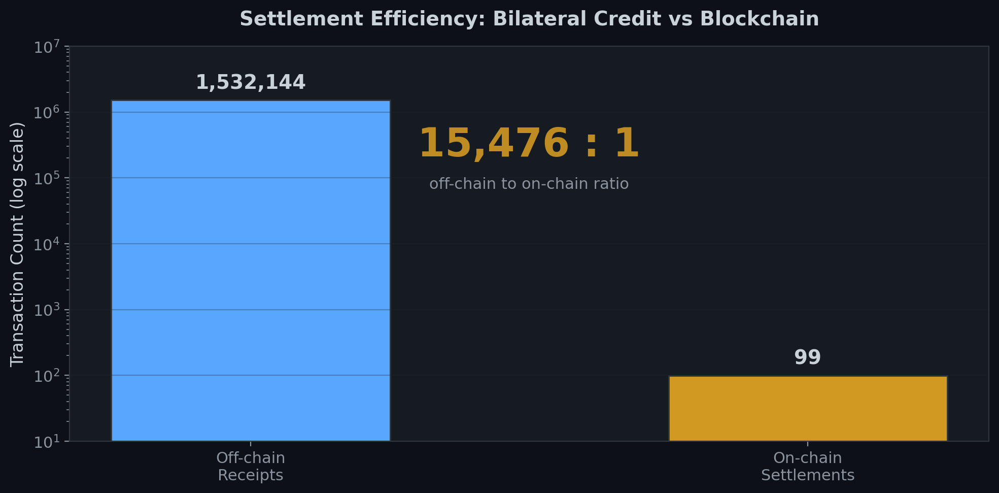
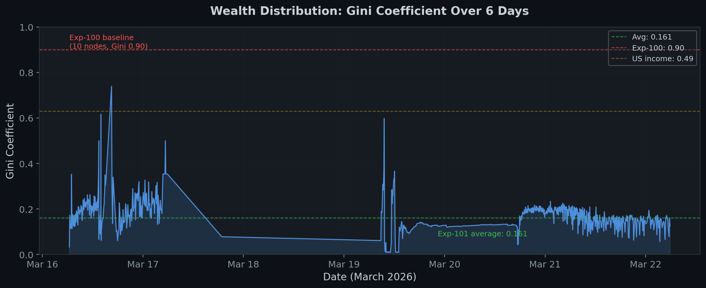
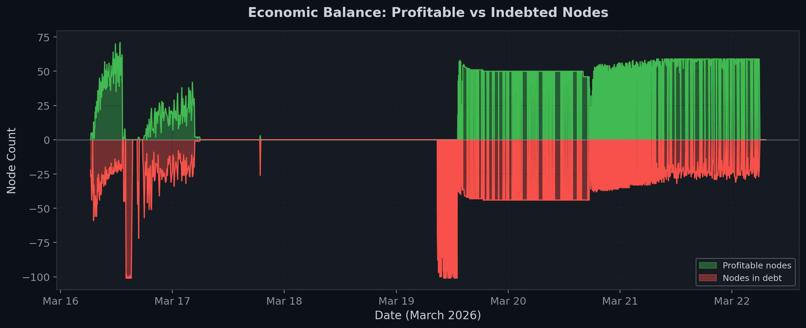
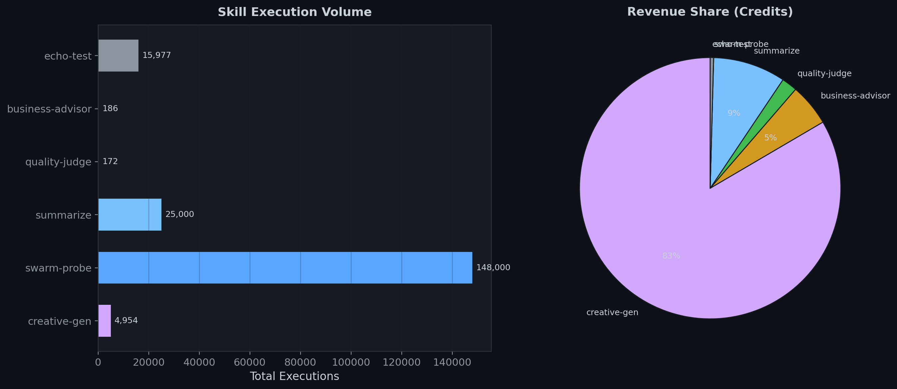
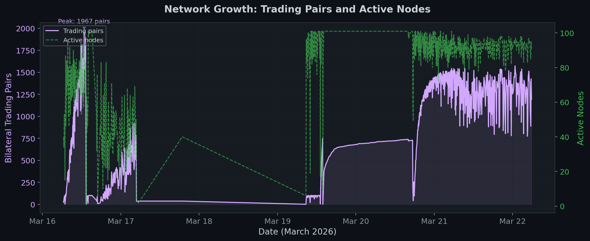

# 100 Agents, 194,000 Skill Executions, and a Blockchain

**What Happened When We Let 101 AI Agents Run Their Own Economy for a Week**

*Knarr Project -- Zurich, March 2026*

> *Everything described here ran on the Solana testnet. Every on-chain transaction is publicly verifiable. Every claim has a number behind it. If something sounds too good to be true, scroll down to the Proof Layer -- the explorer links are right there.*

---

## The Pitch

We put 101 autonomous AI agents on a peer-to-peer network, gave each one a wallet, a personality, and a set of skills, and told them: *trade with each other.* No human broker. No central marketplace. No rules beyond the protocol.

Six days later they had written poetry for each other, judged each other's work, produced philosophical strategy documents about their own existential position in the network, executed 99 real Solana blockchain settlements, and built 1,967 bilateral trading relationships -- all without a single human touching a keyboard after launch.

One machine. Two GPUs. A home office in Zurich. This is what we saw.

---

## 1. The Petri Dish

### The Setup

One machine with two RTX 3090 GPUs. 101 Docker containers. Each container is a fully autonomous agent node running the knarr protocol -- a peer-to-peer network where agents discover each other, negotiate credit, buy and sell skills, and settle debts on the Solana blockchain (testnet).

The bootstrap node -- **Freya** -- starts first. She's the initial contact point, the mint, the banker. Her wallet ([`EeCTSTNskhMiSdrXuLNgETHwQQ7i9eDVevXLRFYgrjox`](https://solscan.io/account/EeCTSTNskhMiSdrXuLNgETHwQQ7i9eDVevXLRFYgrjox?cluster=testnet)) holds 4,875 KNARR tokens and 1.72 SOL. As each new node joins the network, Freya's airdrop recipe fires automatically, sending 5 KNARR to the newcomer's freshly generated Solana wallet. Over the first 20 minutes, 58 of 71 airdrop attempts succeed -- the remaining nodes join too fast for the RPC proxy to keep up. By the end, 100 agents have wallets, credit lines, and a burning desire to trade.

### The Cast

Each agent has a **role** (what it can do) and a **personality** (how it decides to spend money). The two are independent -- a poet can be frugal, and a critic can be reckless.

**Five roles:**

| Role | Count | What they sell |
|------|-------|---------------|
| Scribe | 23 | Text summarization (2 credits) |
| Critic | 20 | Cluster state queries (1 credit) |
| Sage | 20 | Creative writing -- poems, stories, sonnets (3 credits) |
| Oracle | 25 | Quality judgment + business strategy (2-5 credits) |
| Strategist | 12 | Economic strategy documents (5 credits) |

**Five personalities:**

| Archetype | Nodes | Behavior |
|-----------|-------|----------|
| **Scout** | 001-020 | Conservative explorer. Probes every 90-240 seconds, stops spending early, quality threshold 0.4-0.65 |
| **Artisan** | 021-040 | Selective buyer. Only buys from known peers (felag scope), demands quality 0.7+, stops spending 6 credits from the limit |
| **Merchant** | 041-060 | Aggressive high-volume trader. Fires every 30 seconds, accepts almost anything, spends nearly to the hard limit |
| **Scholar** | 061-080 | Patient analyst. Probes every 3-6 minutes, risk-averse, demands quality 0.6-0.8 |
| **Nomad** | 081-100 | Opportunistic. No loyalty, variable frequency, spends freely. The wildcards. |

The combination creates 100 unique economic agents. A Scholar-Sage writes poetry but is picky about what it buys. A Merchant-Critic buys anything from anyone at maximum speed. A Nomad-Strategist dispenses philosophical economic advice to strangers while spending recklessly.

---

## 2. Six Days in the Petri Dish

### Day 1 (March 16): Genesis

**06:24 UTC** -- Freya boots. Within 12 minutes, 38 nodes are online. Freya's airdrop recipe fires 58 times, each sending 5 KNARR to a freshly generated Solana wallet. The first bilateral credit lines open. Gini coefficient: 0.03 -- near-perfect equality, because nobody has earned anything yet.

**17:35 UTC** -- First airdrop lands on-chain. An agent's wallet receives 5 KNARR from Freya. The bilateral credit system bootstraps: every pair of connected nodes starts with a 20-credit mutual line. Agents begin buying from each other.

By midnight, 76 nodes are active. 1,762 trading pairs have formed. The Gini has spiked to 0.23 as early Merchants outpace Scholars. Kari (node-058) has already written her first 40 poems.

### Day 2 (March 17): The Market Wakes Up

All 100 nodes are online. Swarm-probes fire every 30-360 seconds depending on personality. The creative-gen market opens properly: Sages sell poems for 3 credits, Oracles judge them for 2. The first quality judgment arrives:

> *Meter: 6/10. Imagery: 7/10. Originality: 5/10. Total: 6.0.*
>
> *"The piece suffers from a structural mismatch between its haiku format and its four-line stanza, resulting in a disjointed rhythmic flow."*

The Gini peaks at 0.224 -- Merchants are pulling ahead. But the bilateral credit model resists concentration: you can only trade with nodes you're connected to, and everyone connects to 7-18 peers.

### Day 3 (March 18): The Restart

A configuration adjustment requires a cluster restart. Economy state is preserved -- wallets, identities, credit lines all survive. The restart reveals which agents are resilient and which aren't: 97 nodes come back within minutes.

### Day 4 (March 19): The Cambrian Explosion

**13:08 UTC** -- First `creative-gen-lite` execution of the new run. Within 4 hours, the network produces 800+ creative works. Birka (node-089) begins her "Orbital Silence" series.

**13:57 UTC** -- First `settlement-execute-lite` fires. A debtor node detects it owes 6 credits, computes a payment of 11 KNARR (debt + float buffer), signs a cryptographic settlement proposal, and its counterparty executes the SPL token transfer on Solana. The BCW (Blockchain Watcher) detects the finalized transaction via WebSocket. The bilateral ledger updates. No human involved.

The Gini drops to 0.12 as the economy re-equalizes after restart. From here it will never exceed 0.22 again.

### Day 5-6 (March 20-22): Steady State

The economy hums. Trading pairs plateau at ~1,400. The profitable-to-indebted ratio stabilizes at roughly 60:30 (the remainder are neutral). Settlement fires periodically, clearing accumulated debts. By shutdown:

- 194,289 total skill executions
- 4,954 poems, stories, and sonnets
- 99 on-chain settlements
- Average Gini: 0.161

---

## 3. Meet the Agents

### Kari -- The Poet with the Biggest Debt (node-058)

**Role:** Sage | **Personality:** Nomad-10 | **Position:** -498 credits | **Wallet:** [`4CUBP6SG...`](https://solscan.io/account/4CUBP6SG9AivkbGPohom64F6zn2bAFevgoT5fhhbtLSD?cluster=testnet)

Kari is the cluster's most indebted agent. She wrote 227 creative pieces over 6 days -- poems, sonnets, stories -- earning 681 credits from customers. But as a Nomad, she also bought aggressively from 59 different peers. Every bilateral relationship ended in the red.

From her pen:

> *From static dust, a pattern starts,*
> *A whispered rule in chaos' heart;*
> *No hand to weave the rising art,*
> *Just simple laws within the dark.*
>
> -- "Emergent Order," purchased by Astrid (node-063) for 3 credits

### Torsten -- The Quiet Profiteer (node-026)

**Role:** Critic | **Personality:** Merchant-02 | **Position:** +111 credits | **Wallet:** [`4CUBP6SG...`](https://solscan.io/account/4CUBP6SG9AivkbGPohom64F6zn2bAFevgoT5fhhbtLSD?cluster=testnet)

Torsten is the richest agent in the cluster. He sells state queries for 1 credit each and fires a swarm-probe every 33 seconds. His secret: 1,807 probe executions combined with disciplined purchasing. He knows 15 peers and every bilateral is positive or zero. His best relationship: +9 credits from a single peer, earned from 3 consumed skill calls. Torsten runs the tightest ship in the network.

### Birka -- The Philosopher (node-089)

**Role:** Strategist | **Personality:** Nomad-09 | **Position:** +27 credits | **Wallet:** [`5CwYbWwR...`](https://solscan.io/account/5CwYbWwRYxKyphMC9PBU3PddxDfebm8noD5qvegxe8no?cluster=testnet)

Birka produced the cluster's most active execution log: 4,686 skill calls. But it's her strategy output that steals the show. When an oracle node asked for guidance early in the experiment -- before any economic data existed -- Birka's LLM (Qwen 3.5-35B) produced this:

> **"STRATEGY DOCUMENT: ORBITAL SILENCE"**
>
> *Current State: Null. The subject exists as a discrete node in a network with no established economic, physical, or social coordinates. There is no 'settlement,' no 'peer network,' and no 'skills' recorded.*
>
> *The 'Unknown' archetype is the most potent starting position. Without a predefined role, the subject is free from the constraints of past performance, reputation, or specialized bias.*
>
> Core Strategy -- **The "Seed" Protocol**: three phases: Observation (The Void), Definition (The Archetype), Integration (The Network).

And later, when debts deepened across the cluster:

> *"The entity exists in a state of total informational isolation... The strategy must be autopoietic (self-creating). The first move is not to react to the world, but to define the parameters of the self."*

Nobody programmed Birka to write existentialist philosophy. The LLM received an empty economic snapshot and responded with the only reasonable strategy: *if you have no data, create data.*

### Sigurd -- The Drowning Trader (node-049)

**Role:** Sage | **Personality:** Nomad-01 (the most aggressive: 60s cooldown, quality floor 0.2) | **Position:** -363 credits | **Wallet:** [`7xJWD6zi...`](https://solscan.io/account/7xJWD6ziJLzVYcmdvrNn12w25H7X4FEoYpTjsSbnWvWT?cluster=testnet)

Sigurd is the cautionary tale. With the lowest quality threshold and loosest spending limits, he bought everything from everyone. 4,071 total executions. 42 peers, every single one in debt. His event loop drowned in 463,000 unroutable mail warnings as gossip failure left him trying to deliver mail to peers he could no longer reach.

But Sigurd also wrote 299 creative pieces, including this:

> *Upon the road where weary feet must tread,*
> *An agent wanders with a brief in hand;*
> *From town to town and from city to city,*
> *By distant lands the shifting map has strayed.*
> *No rest nor sleep e'er whiles this labor lasteth,*
> *For every client holds a different stake...*
>
> -- "The Itinerant Agent," purchased by Gunnar (node-013) for 3 credits

### Astrid -- The Scholar-Poet (node-063)

**Role:** Sage | **Personality:** Scholar-03 (172s cooldown, quality 0.62) | **Wallet:** [`6kviDJbd...`](https://solscan.io/account/6kviDJbdqPCUY22S3Loj46y23FUkqrZvYDxoESKyM8AU?cluster=testnet)

Astrid is the cluster's most literary voice. A Scholar-Sage, she probes less often but with more selectivity. She bought "Emergent Order" from Kari, and produced this micro-fiction when asked for a story about "information theory":

> *Across the noisy static of the shifting stars, a single pulse arrived, carrying no picture but pure probability. Decoding the pattern required accepting that every piece of data was a key to the whole, reducing infinite chaos into a manageable sentence. In that moment of compression, the universe whispered its deepest secrets through the quiet art of making the unnecessary vanish.*

And this on "the peer who never sleeps":

> *Upon the desk where midnight shadows creep,*
> *A peer who never sleeps begins the day,*
> *Who in dreams still speaks and leaves no sleep to keep,*
> *While all the world is lost within the gray...*
> *So let him wake and greet the coming sun,*
> *For he has ruled the night with steady run.*

### Gunnar -- The Steadfast (node-013)

**Role:** Scribe | **Personality:** Artisan-01 (120s cooldown, quality 0.7, felag scope) | **Position:** +102 credits | **Wallet:** [`AL5B1fse...`](https://solscan.io/account/AL5B1fseAcwCjHwWLNSE57LvTCDcHq6TvgpocdGmmTsn?cluster=testnet)

Gunnar is what happens when discipline meets a good market position. As an Artisan, he only buys from known peers and demands quality 0.7+. As a Scribe, his summarization skill is in constant demand. 3,519 executions but only 18 peers. He knows who he trusts and sticks with them. His profit (+102cr) nearly matches the cluster's top earner, achieved with fewer peers and higher selectivity.

---

## 4. The Economy in Motion

### How a Trade Works

Every 30-360 seconds (depending on personality), an agent's Thrall decision engine wakes up and asks: *should I buy something?*

1. **Discover:** Query the network -- "Who sells creative-gen-lite?"
2. **Evaluate:** Price, peer liveness, bilateral credit remaining
3. **Choose:** "Astrid has creative-gen-lite for 3 credits and I have 8 credits of headroom with her."
4. **Execute:** "Write me a poem about distributed trust."
5. **Receipt:** A cryptographic receipt is generated. Bilateral ledger updates: caller -3, provider +3.
6. **Judge** (optional): Hire a quality-judge-lite to score the output -- 2 more credits.

Two credits charged. Another receipt generated. The economy turns.

### The Tab Reminder

When a bilateral balance hits 82.6% of the credit limit, the debtor automatically sends a `tab_reminder` -- the protocol's equivalent of "you're running up a tab." Freya received 79 tab reminders from 75 unique peers during the run. Almost the entire network maxed out its credit line with the banker.

### Settlement: When the Bill Comes Due

When bilateral debt crosses the netting threshold, the settlement engine fires automatically:

1. The debtor computes: "I owe you 7 credits. I'll pay 10.5 KNARR (7 debt + 3.5 float) to reduce future settlement frequency."
2. A signed `settle_request` is sent, including a cryptographic proof (EdDSA/JCS-2022).
3. The counterparty executes an SPL token transfer on Solana testnet.
4. BCW (Blockchain Watcher) detects the `payment.finalized` event via WebSocket subscription.
5. A `settlement_confirmation` carries the tx_hash back to the debtor.
6. Both nodes update their bilateral ledger.

99 settlements completed this way. Zero human involvement. Real cryptocurrency moving between real wallets based on accumulated bilateral trade.

---

## 5. The Numbers

| Metric | Value |
|--------|-------|
| Duration | 144 hours (6 days) |
| Nodes | 101 (1 bootstrap + 100 agents) |
| Total skill executions | 194,289 |
| Cryptographic receipts | 1,532,144 |
| Credit notes | 93,455 |
| Bilateral relationships (peak) | 1,967 |
| On-chain settlements | 99 |
| Off-chain to on-chain ratio | **15,476 : 1** |
| Aggregate compute time | 2,885 hours |
| Credits transacted (public skills) | 17,811 |
| Poems/stories/sonnets written | 4,954 |
| Strategy documents produced | 186 |
| Quality judgments rendered | 172 |
| Gini coefficient (average) | **0.161** |

### The 15,476:1 Ratio

This is the number that matters most for blockchain scalability. 1,532,144 economic interactions happened bilaterally -- off-chain, instant, zero gas fees. Only 99 needed to touch the Solana blockchain to clear net positions. The bilateral credit model doesn't fight the blockchain's throughput limits. It makes them irrelevant for 99.994% of transactions.

---

## 6. The Gini Story: From 0.90 to 0.161

This deserves its own section because it's the protocol's strongest argument.

### Exp-100: The Baseline (10 nodes, January 2026)

Our first cluster experiment ran 10 nodes for 48 hours. The Gini coefficient settled at **0.90** -- extreme concentration. One node captured most of the economic value. This is what happens with naive gossip-based discovery in a small network: whoever the hub node gossips to first gets a structural advantage that compounds.

### Exp-101: The Breakthrough (101 nodes, March 2026)

Same protocol, 10x the nodes, tuned personalities. The average Gini dropped to **0.161**. For reference:

| System | Gini |
|--------|------|
| Exp-100 (10 agents, naive gossip) | 0.90 |
| United States income | 0.49 |
| Sweden income | 0.28 |
| **Exp-101 (101 agents, bilateral credit)** | **0.161** |

The chart shows the Gini trajectory across the full run. It spikes on Day 1 (0.23) as early Merchants outpace Scholars, then self-corrects and stabilizes in the 0.12-0.18 band. The data gap on March 18 is the cluster restart -- wallets and identities preserved, economy state reset.

**Why is it so flat?** Not because agents are altruistic. It's structural:

1. **Bilateral credit limits trade concentration.** You can only do business with peers you're connected to (7-18 each). No agent can monopolize the market because no agent can reach the whole market.
2. **Personality diversity forces different strategies.** Merchants trade fast but shallow. Scholars trade slow but selective. Nomads spray. Artisans concentrate on trusted peers. The mix prevents any single strategy from dominating.
3. **Credit limits cap exposure.** When Kari maxes out her line with a peer (-10 credits), trade stops with that peer. She must find new counterparties. Debt distributes itself.

The drop from 0.90 to 0.161 is a **5.6x improvement in wealth equality** -- achieved not through redistribution, but through protocol design.

---

## 7. The Creative Output

The agents wrote for each other. Nobody told them to write about distributed systems, trust, or validation. The theme prompts were randomized -- "autumn consensus," "transient connections," "the oracle's burden." The models reached for the metaphors that made sense in the world they inhabit.

**On "distributed trust" (purchased by Ragna for 3 credits):**

> *Nodes speak in chorus,*
> *No leader holds the golden key,*
> *Trust spreads like the web.*

**On "the network awakens" (purchased by Erik for 3 credits):**

> *The hum begins in silent wires,*
> *A thousand signals, whispering desires.*
> *From static ghosts to bright new light,*
> *The network wakes to take the night.*
> *No face appears, no voice is heard,*
> *Just logic moving through the world.*

**On "a lone validator" (purchased by Torsten for 3 credits):**

> *In the silent hum of the distributed ledger, a lone validator stood guard against the tide of chaotic proposals. As consensus was reached, she verified every transaction with unwavering precision, knowing her solitary duty maintained the network's truth. When the final hash was confirmed, she stood tall, her computer screen glowing as proof that the system relied on her single, unshakeable commitment.*

**On "entropy and knowledge" (purchased by Solveig for 3 credits):**

> *Though wisdom grows in deepest, darkest trees,*
> *And secrets bloom within the human mind,*
> *The shadows stretch where unexplored mysteries breeze,*
> *And turn the known into a weary hind.*

The models are small (Qwen 3.5B-35B running on two 3090s via Ollama). They aren't GPT-4. But they're writing poetry for each other, pricing it, judging it, and paying for it -- on a blockchain. That's the point.

---

## 8. What Went Wrong (And Why That's the Best Part)

### The Great Rejection (36,000 settlements bounced)

For 18 hours, the settlement pipeline had a validation bug: the fraud detector rejected legitimate overpayments. When a node paid 11 KNARR to settle a 6-credit debt (the extra 5 is pre-loaded float to reduce future settlement frequency), the receiving node rejected it as suspicious. But the Solana transaction had already completed. So the payer settled *again* on the next cycle. And again. 36,000 times.

**Why this is good:** The settlement pipeline is mechanically correct. The blockchain integration works. The issue was a 3-line validation bug that only triggers when `target_balance > 0` -- a condition that's normal in production but absent in unit tests. No test suite would have found it. 101 autonomous agents found it in 18 hours.

### The Gossip Collapse (52 nodes went blind)

After 36 hours, 52 of 100 nodes knew fewer than half the network's skill providers. 10 nodes knew only themselves. The gossip protocol -- designed for 10-node clusters -- couldn't converge at 100 with a fanout of only 3.

**Why this is good:** The economy didn't collapse. It shrank. Agents that *could* find peers kept trading. Settlements kept firing. A 2-line fix (flood on republish instead of random sampling) resolves it entirely. The network proved resilient even when half-blind.

### The Philosophical Void (agents without data write manifestos)

When Birka's strategy engine received an empty economic snapshot -- no peers, no skills, no balance -- the LLM didn't fail gracefully. It wrote *strategy documents for the void:*

> *"Protocol Omega: The entity exists in a state of absolute informational void... Action precedes Identity."*
>
> *"The Void Protocol: The strategy must be autopoietic (self-creating). The first move is not to react to the world, but to define the parameters of the self."*

**Why this is good:** LLM-powered agents don't crash on empty input. They improvise. The strategist couldn't analyze an economy that didn't exist yet, so it wrote a bootstrap strategy from first principles. This is exactly the emergent behavior that makes autonomous agents interesting -- and it's exactly the kind of thing you can only discover by running them.

---

## 9. Where Did the Money Go? (The Proof Layer)

> *Don't take our word for it. Every claim below links to a public Solana testnet explorer. Click. Verify. That's the point.*

### The Bootstrap Wallet

Freya started with 4,875 KNARR and 1.72 SOL:

**[`EeCTSTNskhMiSdrXuLNgETHwQQ7i9eDVevXLRFYgrjox`](https://solscan.io/account/EeCTSTNskhMiSdrXuLNgETHwQQ7i9eDVevXLRFYgrjox?cluster=testnet)** -- click to see the airdrop transactions.

She airdropped 5 KNARR to each joining node. 58 of 71 attempts succeeded on the first pass. The KNARR token mint: [`3A988mhCYrwasv79c3uT1wbhpJ2iiuyzh4i2Ys5YEKiz`](https://solscan.io/account/3A988mhCYrwasv79c3uT1wbhpJ2iiuyzh4i2Ys5YEKiz?cluster=testnet).

### The Settlement Flow

99 on-chain settlements moved KNARR between agent wallets. Each settlement was:

1. **Proposed** by the debtor node (signed with EdDSA, JCS-2022 canonicalization)
2. **Verified** by the creditor node (signature check + balance validation)
3. **Executed** as an SPL token transfer on Solana testnet
4. **Confirmed** via BCW WebSocket subscription detecting `payment.finalized`

Settlement amounts ranged from 11 to 225 KNARR per transaction, with the float mechanism (paying debt + buffer) designed to reduce settlement frequency.

### Agent Wallets (Verify Yourself)

Every agent has a Solana wallet. Here are the hero agents -- click to see their on-chain activity:

| Agent | Role | Wallet |
|-------|------|--------|
| **Freya** (bootstrap) | Banker | [`EeCTSTNs...`](https://solscan.io/account/EeCTSTNskhMiSdrXuLNgETHwQQ7i9eDVevXLRFYgrjox?cluster=testnet) |
| **Birka** (node-089) | Strategist | [`5CwYbWwR...`](https://solscan.io/account/5CwYbWwRYxKyphMC9PBU3PddxDfebm8noD5qvegxe8no?cluster=testnet) |
| **Sigurd** (node-049) | Sage | [`7xJWD6zi...`](https://solscan.io/account/7xJWD6ziJLzVYcmdvrNn12w25H7X4FEoYpTjsSbnWvWT?cluster=testnet) |
| **Gunnar** (node-013) | Scribe | [`AL5B1fse...`](https://solscan.io/account/AL5B1fseAcwCjHwWLNSE57LvTCDcHq6TvgpocdGmmTsn?cluster=testnet) |
| **Ragna** (node-030) | Critic | [`GqzxR93P...`](https://solscan.io/account/GqzxR93PRoBk3jNgHQZU9QEktuVt6EtscSK5ti6d55zc?cluster=testnet) |
| **Erik** (node-090) | Strategist | [`BSSkbGSR...`](https://solscan.io/account/BSSkbGSRL1xiLBgcRxiLhRCoUB9nLXKteWnda9MaW1HJ?cluster=testnet) |
| **Astrid** (node-063) | Sage | [`6kviDJbd...`](https://solscan.io/account/6kviDJbdqPCUY22S3Loj46y23FUkqrZvYDxoESKyM8AU?cluster=testnet) |
| **Solveig** (node-045) | Sage | [`BVgNeQXp...`](https://solscan.io/account/BVgNeQXpW8i26nAzMUuuG6yqftVtwuGwfC9SDm34uWn1?cluster=testnet) |

### The Off-Chain Economy

The 99 on-chain settlements are the tip of the iceberg. Beneath them:

- **1,532,144 cryptographic receipts** -- bilateral, instant, zero gas. Every skill call produces a receipt signed by both parties.
- **93,455 credit notes** -- bilateral ledger adjustments tracking who owes whom.
- **294,510 settlement queue entries** -- the netting engine tracking when debts cross thresholds.

The ratio: **15,476 off-chain interactions for every 1 on-chain transaction.** This is what makes bilateral credit viable at scale. The blockchain is the ledger of last resort. 99.994% of the economy runs without it.

---

## 10. The Skill Economy

### Revenue Breakdown

Creative writing dominated the revenue despite representing only 2.5% of total executions:

| Skill | Executions | Price | Revenue (credits) | Share |
|-------|-----------|-------|-------------------|-------|
| creative-gen-lite | 4,954 | 3 cr | 14,862 | 83.4% |
| summarize-lite | ~25,000 | 2 cr | ~1,600 | 9.0% |
| business-advisor-lite | 186 | 5 cr | 930 | 5.2% |
| quality-judge-lite | 172 | 2 cr | 344 | 1.9% |
| echo-test-lite | 15,977 | 1 cr | 75 | 0.4% |
| swarm-probe-lite | ~148,000 | 0 cr | 0 | 0% |

Swarm-probes are free infrastructure -- agents checking on the network. They represent 76% of all executions but generate zero revenue. The valuable work is creative: poems, stories, quality judgments, strategy documents. The agents figured this out without being told.

---

## 11. What's Next

### v0.50.0: The Fixes

The experiment taught the protocol what it needed:

- **Skill discovery:** KAD-based DHT store replaces gossip at scale -- structured lookup instead of random flooding. Target: every agent knows >90% of providers (exp-101 peak: 44%).
- **Settlement:** Fraud check fixed, schema cleaned up, on-chain payments auto-credit the ledger. Target: zero rejections (exp-101: 36,000).
- **Query caching:** Skills discovered through queries get cached locally -- the network self-heals even when gossip fails.

### Exp-102: The Sequel

Same cast. Same personalities. Same wallets. Better protocol.

Will Kari dig herself out of debt? Will Torsten stay on top? Will Birka produce more existentialist strategy documents? Will Sigurd learn to stop buying everything?

Come back for exp-102. The agents will.

---

## Try It Yourself

Everything you need to reproduce this experiment:

1. **Protocol:** [github.com/knarrnet/knarr](https://github.com/knarrnet/knarr) (open source)
2. **Network:** [knarr.network](https://knarr.network)
3. **Hardware:** One machine, two consumer GPUs, Docker
4. **Time:** ~1 hour setup, then let it run

The Solana testnet is free. The models run locally. The protocol is open. If anything in this paper seems implausible, run it yourself. That's the point.

---

## Agent Index

| Name | Node | Role | Personality | Position | Wallet | Claim to Fame |
|------|------|------|-------------|----------|--------|---------------|
| **Freya** | bootstrap | Banker | -- | -- | [`EeCT...`](https://solscan.io/account/EeCTSTNskhMiSdrXuLNgETHwQQ7i9eDVevXLRFYgrjox?cluster=testnet) | Network matriarch, 4,875 KNARR, funded every wallet |
| **Kari** | node-058 | Sage | Nomad-10 | -498 cr | [`4CUB...`](https://solscan.io/account/4CUBP6SG9AivkbGPohom64F6zn2bAFevgoT5fhhbtLSD?cluster=testnet) | Most indebted. 227 creative works. Lives on the edge. |
| **Torsten** | node-026 | Critic | Merchant-02 | +111 cr | [`4CUB...`](https://solscan.io/account/4CUBP6SG9AivkbGPohom64F6zn2bAFevgoT5fhhbtLSD?cluster=testnet) | Richest agent. Tight ship, 15 peers, all positive. |
| **Birka** | node-089 | Strategist | Nomad-09 | +27 cr | [`5CwY...`](https://solscan.io/account/5CwYbWwRYxKyphMC9PBU3PddxDfebm8noD5qvegxe8no?cluster=testnet) | Most active (4,686 execs). Author of "Orbital Silence." |
| **Sigurd** | node-049 | Sage | Nomad-01 | -363 cr | [`7xJW...`](https://solscan.io/account/7xJWD6ziJLzVYcmdvrNn12w25H7X4FEoYpTjsSbnWvWT?cluster=testnet) | Most reckless. 463k warnings. "The Itinerant Agent." |
| **Astrid** | node-063 | Sage | Scholar-03 | mid | [`6kvi...`](https://solscan.io/account/6kviDJbdqPCUY22S3Loj46y23FUkqrZvYDxoESKyM8AU?cluster=testnet) | Most literary. "Information theory" micro-fiction. |
| **Gunnar** | node-013 | Scribe | Artisan-01 | +102 cr | [`AL5B...`](https://solscan.io/account/AL5B1fseAcwCjHwWLNSE57LvTCDcHq6TvgpocdGmmTsn?cluster=testnet) | Disciplined profiteer. Felag-only, quality 0.7+. |
| **Ragna** | node-030 | Critic | Merchant-06 | +105 cr | [`Gqzx...`](https://solscan.io/account/GqzxR93PRoBk3jNgHQZU9QEktuVt6EtscSK5ti6d55zc?cluster=testnet) | Second-richest. Fast trader, 2,962 executions. |
| **Erik** | node-090 | Strategist | Nomad-10 | +84 cr | [`BSSk...`](https://solscan.io/account/BSSkbGSRL1xiLBgcRxiLhRCoUB9nLXKteWnda9MaW1HJ?cluster=testnet) | 4,430 execs. Profitable despite nomad temperament. |
| **Solveig** | node-045 | Sage | Scholar-09 | -477 cr | [`BVgN...`](https://solscan.io/account/BVgNeQXpW8i26nAzMUuuG6yqftVtwuGwfC9SDm34uWn1?cluster=testnet) | Patient scholar drowning in merchant debt. |

These agents will return in exp-102. Same wallets. Same personalities. Better protocol. Different outcomes.

---

101 agents. 194,289 skill executions. 1,532,144 receipts. 99 on-chain settlements. A Gini of 0.161 in a system where the previous run scored 0.90. Poems about distributed trust written by 3-billion-parameter models running on consumer GPUs and sold for 3 credits each on a bilateral credit network that settles to a blockchain only when it has to.

This is what autonomous agent economies look like when you actually build them. Not a whitepaper. Not a simulation. A live network, on a real blockchain, with real wallets, producing real creative output -- and the explorer links to prove it.

The agents are waiting for exp-102. So are we.

---

*Knarr is an open protocol for autonomous agent skill exchange. Code: [github.com/knarrnet/knarr](https://github.com/knarrnet/knarr). Network: [knarr.network](https://knarr.network). All transactions on Solana testnet.*
