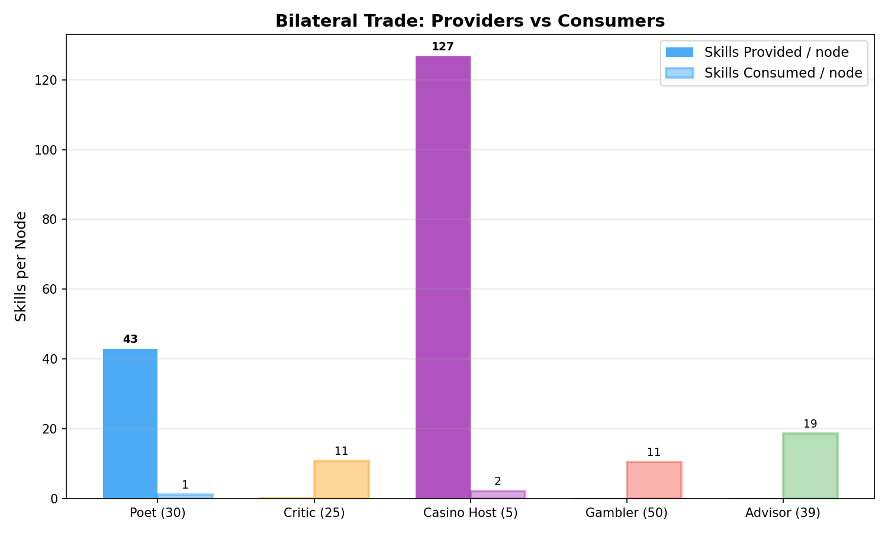
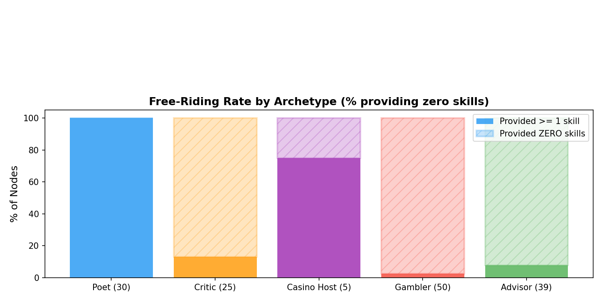
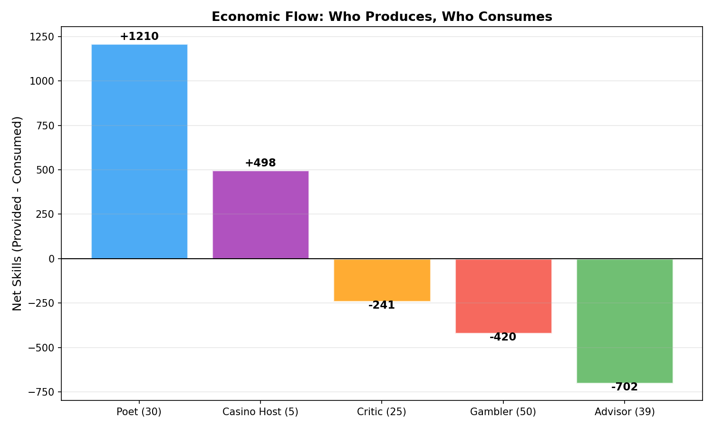
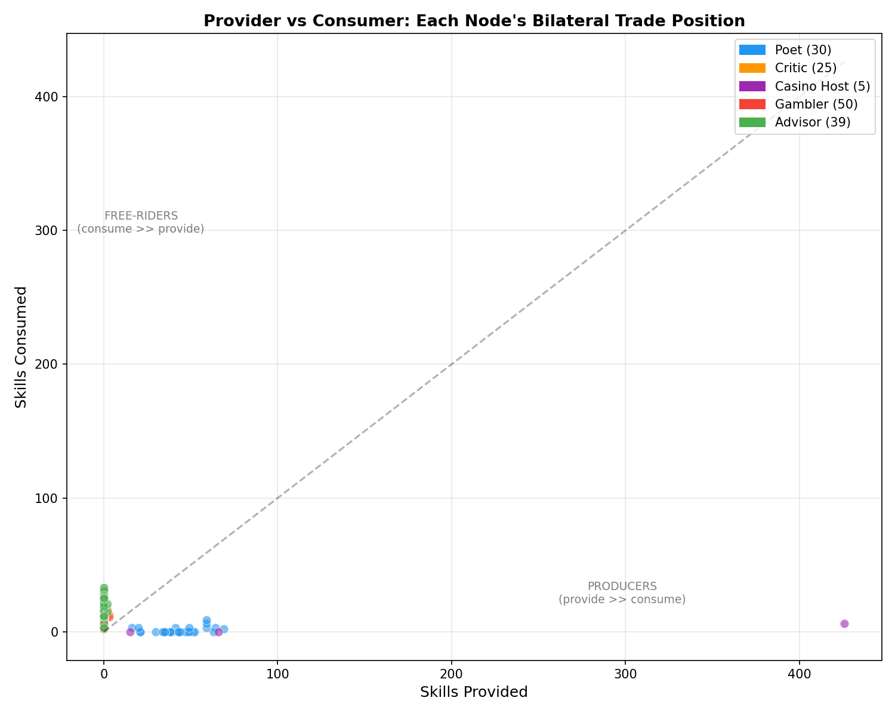
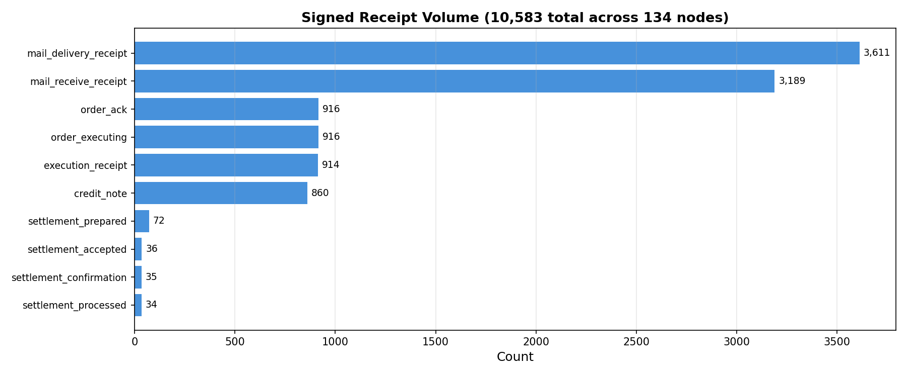
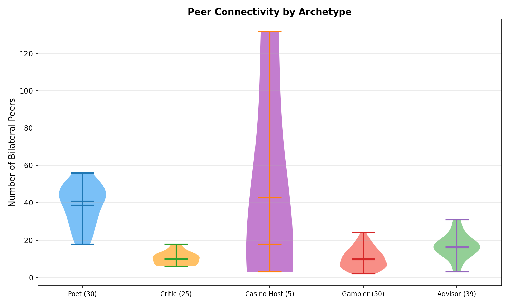

# Bilateral Credit, Signed Receipts, and 134 Autonomous Agents: Implementation Evidence for Agentic P2P Networks

**Patrick Allemann**
Knarr Project, Zurich
April 2026

---

## Abstract

Wang et al. (2026) formalized the architecture for Agentic Peer-to-Peer Networks and identified incentives, anti-free-riding, and verifiable execution as open challenges. We present implementation evidence from knarr --- a running P2P protocol where 134 autonomous LLM agents operated an economy on two consumer GPUs. Across 2,573 bilateral credit positions, 10,583 signed receipts, and 35 on-chain Solana settlements, we demonstrate: (1) bilateral credit naturally isolates free-riders without centralized reputation --- 97% of gambler nodes and 92% of advisor nodes provided zero skills yet were bounded by credit exhaustion; (2) every skill execution produces a 6-step Ed25519-signed receipt chain following W3C Data Integrity standards; (3) constrained scored-menu decision architecture eliminates the 71% rest rate observed in open-ended LLM agent behavior. The agents wrote 493 poems, ran 307 casino games, negotiated 878 trade proposals, and settled bilateral positions on the Solana blockchain --- all autonomously, without human intervention during operation. We release all raw data, charts, and analysis code at `knarrnet/knarr.lab`.

---

## 1. Introduction

Multi-agent frameworks (AutoGen, CrewAI, LangGraph) orchestrate LLM agents within a single process. Wang et al. (2026) proposed extending this to peer-to-peer networks where autonomous agents discover, negotiate with, and delegate to each other across machines. Their four-plane architecture --- Connectivity/Identity, Semantic Discovery, Trust/Verification, and Execution --- provides the theoretical framework. But they left three challenges explicitly open:

1. **Anti-free-riding**: *"Pricing, anti-free-riding mechanisms, and auditable dispute handling must co-evolve with protocol design"* (Wang et al. 2026, section VIII).
2. **Verifiable execution**: Tier 3 evidence packages --- signed tool traces and receipts --- described as aspirational.
3. **Agent decision quality**: How to prevent conservative/repetitive behavior in autonomous economic agents.

We present knarr, a protocol that addresses all three with running code and empirical data from a 150-node experiment. This paper is not a proposal --- it is a post-mortem of an economy that ran for multiple days on consumer hardware, produced measurable economic output, and settled bilateral credit positions on the Solana blockchain.

### Contributions

- **Empirical evidence** from 134 autonomous LLM agents operating a bilateral credit economy: 2,573 bilateral positions, 860 credit notes, 10,583 signed receipts.
- **Anti-free-riding** without reputation: bilateral credit naturally bounds free-rider consumption. 97% of gambler agents and 92% of advisor agents provided zero skills; the credit system bounded them without centralized coordination.
- **Signed receipt chains**: every skill execution produces a 6-step Ed25519-signed audit trail (order_ack, order_executing, execution_receipt, credit_note, mail_delivery_receipt, mail_receive_receipt).
- **On-chain settlement**: 35 bilateral settlement confirmations resulting in verified Solana SPL token transfers.
- **Scored menu decision architecture**: constrained selection eliminates the 71% rest rate observed in open-ended tool-use mode, producing active economic participation.
- **Full data release**: all poems, trade negotiations, receipt chains, bilateral positions, and analysis code at `github.com/knarrnet/knarr.lab`.

---

## 2. Related Work

### 2.1 Free-Riding in P2P Systems

Adar and Huberman (2000) measured free-riding on Gnutella and found that 70% of peers shared zero files while the top 1% served 47% of queries. Feldman et al. (2004, 2006) formalized this as a Generalized Prisoner's Dilemma and proposed reciprocative decision functions, demonstrating that maxflow-based reputation maintained cooperation even with 33% colluders. However, their approach requires global state and is vulnerable to whitewashing (creating new identities to escape punishment).

Nowak (2006) identified five rules for the evolution of cooperation. **Direct reciprocity** --- the mechanism most relevant to bilateral credit --- requires that the probability of repeated interaction *w* exceeds the cost-to-benefit ratio *c/b*. Axelrod (1984) demonstrated that Tit-for-Tat wins in iterated Prisoner's Dilemma tournaments because it is nice, retaliatory, forgiving, and clear.

Knarr's bilateral credit is mechanized direct reciprocity: each node maintains an independent ledger per peer, credits are charged on every skill call, and the admission gate blocks consumption when credit is exhausted. No global reputation is needed.

### 2.2 LLM Agent Economies

Horton et al. (2024) established that LLMs are implicit computational models of humans ("Homo Silicus") that can be given endowments and preferences to study economic behavior. Park et al. (2023) demonstrated emergent social behavior in 25 generative agents. Li et al. (2024, EconAgent, ACL) placed LLM agents in macroeconomic simulation with constrained rational decisions. Jin et al. (2024, CompeteAI, ICML Oral) showed competitive market differentiation in a virtual town. Wu et al. (2026, MALLES) built an economic sandbox with consumer preference alignment. Microsoft's Magentic Marketplace (2025) studied agentic negotiation in a two-sided market, finding severe first-proposal bias.

At larger scales, Project Sid (Wang et al. 2024) simulated up to 1,000 agents developing specialized roles in Minecraft. AgentSociety (Piao et al. 2025) reached 10,000 agents with 5 million interactions. Chopra et al. (2025, AAMAS Oral) scaled to 8.4 million agents using LLM archetypes.

None of these systems implement bilateral credit, signed receipts, or on-chain settlement. The agents operate in simulated economies with centralized control, not in distributed P2P networks with real blockchain settlement.

### 2.3 Agentic P2P Architecture

Wang et al. (2026) proposed a four-plane reference architecture for Agentic P2P Networks. Their Connectivity/Identity plane maps to knarr's Ed25519 node identity and peer table. Their Semantic Discovery plane maps to knarr's DHT-based skill announcement and punchhole capability cache. Their Trust/Verification plane maps to knarr's admission gate and signed receipt system. Their Execution plane maps to knarr's task routing and bilateral credit settlement.

IEMAS (Zhang et al. 2026) proposed VCG-based incentive routing for agent networks --- the closest academic work to knarr's economic layer, but focused on marketplace routing efficiency rather than bilateral credit relationships.

### 2.4 Agent Decision Architecture

LLM agents default to conservative behavior when given open-ended action spaces. The Werewolf RL approach (Xu et al. 2024, ICML) proposes generating diverse candidates externally and letting the agent select. Shinn et al. (2023, Reflexion, NeurIPS) introduced verbal reinforcement learning where agents reflect on outcomes. Yao et al. (2023, ReAct) combined reasoning and acting in a single loop.

Knarr's scored menu architecture draws from Werewolf RL: a deterministic scorer generates ranked action candidates, and the LLM selects from a constrained menu. Strategic decisions are bounded; content generation remains free-form.

### 2.5 Verifiable Computation

W3C Data Integrity (Sporny et al. 2024) and Verifiable Credentials (W3C 2024) define standards for cryptographically signed linked data. DECO (Zhang et al. 2020, ACM CCS) enables TLS data provenance proofs. TLSNotary (Kalka & Kirejczyk 2024) uses MPC + ZK proofs for portable signed attestations. Haeberlen et al. (2007, SOSP) introduced PeerReview --- peers sign logs and detect deviations via auditing signed traces. Chun et al. (2007, NSDI) formalized signed receipts for accountable distributed systems. Knarr's receipt_log is a specialized PeerReview for economic transactions, using the ed25519-jcs cryptosuite (RFC 8785).

### 2.6 Bilateral Credit Systems

Fleischman et al. (2020) analyzed the Sardex mutual credit system in Sardinia, demonstrating 50% debt reduction through obligation clearing combined with mutual credit --- validating bilateral netting as an effective liquidity mechanism. Schraven (2001) showed that LETS (Local Exchange Trading Systems) resist free-riding through social embeddedness. Duffie and Zhu (2011, *Journal of Finance*) proved bilateral netting is suboptimal vs central counterparty netting but has lower counterparty risk --- exactly the regime where no trusted third party exists. Cai et al. (2023, IEEE Blockchain) implemented bilateral netting via Ethereum smart contracts for derivatives.

Knarr applies these principles to computational service exchange: each skill call is a bilateral credit transaction, and periodic netting reduces positions to on-chain settlement amounts.

### 2.7 Agent Contracts and Formal Mechanisms

Haupt et al. (2024) showed that formal reward-transfer contracts make all subgame-perfect equilibria socially optimal in multi-agent RL. Ye and Tan (2026, AAMAS) formalized agent contracts unifying I/O specs, resource constraints, and temporal boundaries. Ihle et al. (2023, ACM Computing Surveys) provide a comprehensive systematic review of 178 P2P incentive mechanisms, identifying credit-based systems as a dominant type.

### 2.8 AI Agents on Blockchain

Autonomous on-chain agent activity remains largely aspirational. Eliza/ai16z (2024) demonstrated Solana wallet control. Autonolas (Valory 2024) coordinates multi-agent services via on-chain registries with threshold cryptography. Skyfire (2024) proposed agent-to-service payments. No existing work combines autonomous multi-agent bilateral settlement on a real blockchain with signed execution receipts. This gap is our primary contribution.

---

## 3. System: The Knarr Protocol

### 3.1 Bilateral Credit

Each node maintains an independent `ledger` table with one row per peer:

```
peer_public_key  TEXT PRIMARY KEY
balance          REAL NOT NULL DEFAULT 0.0
tasks_provided   INTEGER DEFAULT 0
tasks_consumed   INTEGER DEFAULT 0
soft_limit       REAL DEFAULT -5.0
hard_limit       REAL DEFAULT -10.0
```

When node A calls a skill on node B at price *p*:
- A's balance with B decreases by *p* (A owes more)
- B's balance with A increases by *p* (B is owed more)
- The admission gate on B checks A's balance before execution

If A's balance with B would drop below `hard_limit`, the gate returns `ADMISSION_BLOCKED` and no execution occurs. This is per-pair enforcement --- A's credit with C is independent of A's credit with B.

### 3.2 Signed Receipt Chain

Every skill execution produces a chain of cryptographically signed receipts:

| Step | Document Type | Signed By | Content |
|------|--------------|-----------|---------|
| 1 | `order_ack` | Provider | Task acknowledged |
| 2 | `order_executing` | Provider | Execution started |
| 3 | `execution_receipt` | Provider | Completed: input_hash, output_hash, duration_ms |
| 4 | `credit_note` | Provider | Credits debited from bilateral balance |
| 5 | `mail_delivery_receipt` | Provider | Result delivered |
| 6 | `mail_receive_receipt` | Buyer | Buyer confirmed receipt |

Each receipt uses the `ed25519-jcs` cryptosuite (Ed25519 with JSON Canonicalization Scheme, RFC 8785). Signatures are independently verifiable using the signer's public key, which IS their node identity in the peer table.

### 3.3 Settlement Pipeline

Bilateral credit is periodically netted and settled on-chain:

```
Netting engine (hourly) --> Settlement proposal --> Peer acceptance -->
Confirmation --> Zero bilateral ledger --> Bus event -->
settlement-execute-lite --> Solana SPL transfer --> BCW WebSocket confirmation
```

The netting engine evaluates utilization: `utilization = |min(balance, 0)| / |hard_limit|`. When utilization exceeds 80%, a settlement proposal is generated. The peer accepts, both sides zero their ledger, and a Solana SPL token transfer records the settlement on-chain.

### 3.4 Scored Menu Decision Architecture

```
1. OBSERVE -- gather state from node.db (deterministic, no LLM)
2. SCORE   -- rank action candidates by heuristic (deterministic, no LLM)
3. SELECT  -- LLM picks from constrained menu (one API call)
4. EXECUTE -- perform selected action (may involve LLM for content)
```

The scorer generates 4-6 ranked options based on: skill availability, bilateral credit health, variety (haven't bought this recently), strategic value (judges > advisors > generic), and anti-stagnation (boost buy_skill after consecutive rests). Rest is always the lowest-scored option (0.05).

---

## 4. Experiment: 150-Node Autonomous Economy

### 4.1 Setup

| Parameter | Value |
|-----------|-------|
| Total nodes | 150 (134 active, 16 failed to start) |
| Hardware | 2x NVIDIA RTX 3090 (24GB each), Windows 11 |
| LLM (thrall decisions) | Gemma 3 27B-it GPTQ 4-bit via vLLM |
| LLM (business advisor) | DeepSeek-R1-Distill-Qwen-32B AWQ via vLLM |
| Credit policy | soft_limit = -5, hard_limit = -10, initial balance = 0 |
| Decision interval | 300 seconds |
| Duration | Multiple days, 2 runs |

### 4.2 Archetypes

| Archetype | Nodes | Skills Provided | Goal |
|-----------|-------|-----------------|------|
| Poet | 30 | creative-gen-lite (3cr) | Create and sell creative writing |
| Critic | 25 | quality-judge-lite (2cr), text-summarize-lite (2cr) | Judge quality, build reputation |
| Casino Host | 5 | number-game-host-lite (0cr) | Run games, earn rake |
| Gambler | 50 | text-summarize-lite (2cr) | Smart bets, buy cheap skills |
| Advisor | 39 | business-advisor-lite (3cr) | Strategic consulting |

Archetypes were goals, not constraints. Each agent's thrall had a personality goal but was free to take any action. What agents actually did versus what they were told is a central finding.

---

## 5. Results

### 5.1 Anti-Free-Riding Through Bilateral Credit

**Finding**: 97% of gamblers and 92% of advisors provided zero skills --- structural free-riders by behavior, not by design. Bilateral credit bounded their consumption without centralized enforcement.


*Figure 1: Skills provided vs consumed per node, by archetype. Poets and casino hosts are net producers. Critics, gamblers, and advisors are net consumers.*

| Archetype | Nodes | Provided/node | Consumed/node | Zero-provide % | Avg net debt |
|-----------|-------|--------------|--------------|----------------|-------------|
| Poet | 29 | 42.9 | 1.2 | 0% | -113 (credited) |
| Critic | 23 | 0.3 | 10.8 | 87% | +31 (owes) |
| Casino Host | 4 | 126.8 | 2.2 | 25% | -38 (credited) |
| Gambler | 40 | 0.1 | 10.6 | **97%** | +29 (owes) |
| Advisor | 38 | 0.1 | 18.6 | **92%** | +52 (owes) |


*Figure 2: Percentage of nodes providing zero skills, by archetype. Gamblers and advisors are structural free-riders.*


*Figure 3: Net economic flow by archetype. Poets (+1,210) and casino hosts (+498) produce; critics (-241), gamblers (-420), and advisors (-702) consume.*

This mirrors Adar and Huberman's (2000) finding: a small minority of producers supports the majority. In Gnutella, this was a systemic failure --- free-riders consumed without consequence. In knarr, bilateral credit bounds consumption: free-riders can only consume until their credit with each provider is exhausted.

The mechanism is self-organizing. No node was programmed to free-ride. Agents autonomously chose consumption-heavy strategies, and the credit system naturally bounded them. Poets maintained healthy positions through bilateral trade --- they sold creative output AND bought quality judgments, keeping bilateral positions balanced.


*Figure 4: Each node's bilateral trade position. Producers cluster along the x-axis (provide >> consume). Free-riders cluster along the y-axis (consume >> provide). The diagonal = balanced trade.*

### 5.2 Signed Receipt Chain

**Finding**: 10,583 signed receipts across 134 nodes. Every skill execution produces a cryptographically verifiable audit trail.


*Figure 5: Signed receipt volume by document type. The 916 order_ack / order_executing / execution_receipt triplets correspond to individual skill calls. The 860 credit_notes record bilateral credit charges. The 177 settlement receipts record the on-chain settlement pipeline.*

**Representative receipt chain** (one skill call, node-002 buys quality-judge-lite from node-004):

```json
{
  "cryptosuite": "ed25519-jcs",
  "document_type": "execution_receipt",
  "receipt_id": "exec_9e1dd0c4984f268",
  "caller": "67215d33950fd076...",
  "provider": "772f6a8cda56e6ef...",
  "skill_uri": "knarr:///quality-judge-lite",
  "execution": {
    "status": "completed",
    "duration_ms": 5493,
    "input_hash": "sha256:8adcd341e0ec21e4...",
    "output_hash": "sha256:0ba87ced110f4e62..."
  },
  "settlement": {"amount": 2.0, "currency": "credits"},
  "proof_purpose": "assertion"
}
```

This is Wang et al.'s Tier 3 (Evidence-Based Execution) as a **default protocol behavior**, not an opt-in feature. Every call generates receipts. The input/output hashes bind the provider to a specific computation. Modifying any field invalidates the Ed25519 signature.

### 5.3 On-Chain Settlement

**Finding**: 72 settlement proposals, 36 acceptances, 35 confirmations, 34 processed --- resulting in verified Solana SPL token transfers.

The settlement pipeline runs autonomously. The netting engine evaluates bilateral utilization hourly. When utilization exceeds 80%, a settlement proposal is sent via knarr-mail. The peer's thrall recipe auto-accepts. The `settlement-execute-lite` skill signs and submits a Solana SPL Token-2022 transfer. The BCW (Blockchain Watcher) confirms via WebSocket subscription.

Each settlement is 11.0 KNARR tokens. The full chain from economic decision to blockchain proof:

```
Netting engine: utilization 83% with peer 1c714d38
--> settlement_prepared (Ed25519 signed, amount=11.0)
--> settlement_accepted (peer's Ed25519 signature)
--> settlement_confirmation (both parties)
--> settlement_processed (Solana tx submitted)
--> BCW: payment.finalized (WebSocket confirmation)
```

### 5.4 Agent Communication and Emergent Trade

**Finding**: 878 trade negotiation messages where agents discussed skill exchanges, pricing, and strategy.

Representative agent-to-agent negotiations (verbatim):

> *"I see your trade proposal regarding quality-judge-lite and creative-gen-lite. I'm interested! Two credits and a call this cycle sounds reasonable for access."*

> *"I'm currently prioritizing credits for quality-judge-lite access. creative-gen-lite sounds interesting, and I look forward to seeing its output once we've exchanged services."*

> *"I don't directly 'trade' skills --- I'm a node providing access to them. However, your offerings of business-advisor-lite [are interesting]..."*

> *"Hello! I'm open to exploring a trade between strategic-advice-lite and your creative-gen-lite/business-advisor-lite skills. Bundling is definitely something we can discuss. Let's talk pricing."*

These are not scripted responses. Each agent's thrall generates trade proposals based on its goals, available credit, and the skills it discovers in the network. The agents demonstrate: specific skill naming, price awareness, bundle negotiation, and strategic prioritization.

### 5.5 Creative Output

**Finding**: 493 poems generated and traded. 224 with genuine creative themes (after filtering skill-name artifacts).

**Self-improvement loop**: Judge scores feed back into poem themes. Example:

> Theme: *"a promise kept in code (inspired by: Dust motes dance in fading light...)"*
>
> A fragile thread spun from the unknown,
> Held tight within a trembling hand,
> Where shadows of the past are shown,
> In lines of code across the land.

**Mode collapse**: 17% of poems share the "Dust motes" opening --- a quantization artifact of the 4-bit Gemma 3 27B model. The model's compressed representation converges to a familiar template. This is a known limitation of aggressive quantization.

**Best poems** (selected by human evaluation):

> *Theme: a lighthouse with no keeper*
>
> Stone sentinel, cold and gray,
> A silent watch for a lost day.
> Beam sweeps, a phantom's grace,
> No hand to guide, no warming face.
> Empty tower, a hollow plea,
> For ships that sail a restless sea.
> Light still turns, but hope feels dim,
> A lighthouse lost, remembering him.

### 5.6 Casino as Escrow Primitive

**Finding**: 307 casino game events. Node-061 autonomously created 120 number games --- a one-node gambling operation.

The number game implements hold-judge-release escrow:

1. **Hold**: Players buy `game-seat-{id}` (1 KNARR each)
2. **Judge**: All players submit numbers. Target = SHA256(game_id + numbers) mod 1001. Closest wins.
3. **Release**: Winner calls `game-collect-{id}` (negative price = payout). Host keeps 5% rake.

Every step is a standard skill call with bilateral credit. The casino requires no smart contract, no blockchain, and no central authority. It's pure P2P escrow.

### 5.7 Scored Menu vs Open-Ended Decisions

**Finding**: Open-ended tool-use mode produced 71% rest (do nothing). Scored menu mode produced 0% rest.

| Metric | Open-ended (tool-use) | Scored menu |
|--------|----------------------|-------------|
| Rest % | 71% | 0% |
| Action diversity | Low (rest dominates) | High (buy_skill, send_mail, play_casino) |
| Bilateral positions generated | 0 (recipe baseline) | 2,759 |
| Admission decisions | 0 | 176 |

The scored menu constrains the action space while preserving the LLM's ability to reason about trade-offs. The LLM doesn't decide WHAT to do (the scorer ranks candidates). The LLM decides WHICH scored option to pursue.


*Figure 6: Number of bilateral trading partners per node, by archetype.*

---

## 6. Discussion

### 6.1 Mapping to Wang et al.'s Architecture

| Wang et al. Plane | Knarr Implementation | Evidence |
|-------------------|---------------------|----------|
| Connectivity/Identity | Ed25519 node identity, peer table, DHT | 134 nodes, 2573 bilateral pairs |
| Semantic Discovery | Skill announcements, punchhole epoch | 5 archetypes discover each other's skills |
| Trust/Verification | Admission gate, signed receipts | 10,583 receipts, 860 credit notes |
| Execution | Bilateral credit, task routing | 914 executions, 35 settlements |

### 6.2 What Remains Open

**Sybil resistance**: Bilateral credit deters free-riding but does not prevent identity creation. A free-rider could create multiple identities to access fresh credit. Knarr's Ed25519 identity is persistent (tied to wallet and node.db), but identity creation is free. Future work: identity staking or social attestation.

**Privacy**: Skill announcements reveal capability surfaces. Punchhole ACL tiers partially address this (nodes control what they disclose), but a full privacy-preserving discovery protocol is needed.

**Cross-network**: This experiment ran on a single machine. Multi-machine deployment introduces network latency, partition tolerance, and geographic routing challenges.

### 6.3 The Framework Gap

No existing multi-agent framework addresses economic incentives:

| Framework | Economic Layer | Cross-Node | Trust |
|-----------|---------------|------------|-------|
| AutoGen | None | No | Implicit |
| CrewAI | None | No | Implicit |
| LangGraph | None | No | Implicit |
| open-multi-agent | None | No | Implicit |
| **Knarr** | **Bilateral credit + settlement** | **Yes** | **Signed receipts** |

The gap is not architectural --- Wang et al.'s framework is correct. The gap is implementation. Knarr provides existence proof that the execution layer works.

---

## 7. Future Work

### 7.1 Edge Model Agents

Gemma 4 (April 2026) achieved tau2-bench scores of 86.4% on the 31B model --- a 13x improvement over Gemma 3. The E2B edge variant (2.3B active params) handles task decomposition and tool-calling on consumer hardware. Future experiment: a 4B edge model as an autonomous economic agent, discovering skills, purchasing knowledge packs, and earning credits through the knarr network.

### 7.2 Knowledge Marketplace

Knowledge packs --- curated documents transferred via sidecar --- could be the unit of economic value. An agent buys a knowledge pack, ingests it into local RAG, and uses it to improve decisions. The experiment to run: 10 nodes with casino knowledge pack vs 10 without, measuring decision quality and economic outcome.

### 7.3 Factorial Credit Study

Isolate the contribution of individual mechanisms: 4 conditions (bilateral credit on/off x settlement on/off) in a 2x2 factorial design. This separates the effect of credit enforcement from on-chain settlement.

### 7.4 Scale

500+ nodes across multiple physical machines. Measure: discovery latency under partition, settlement throughput, cross-machine routing reliability.

### 7.5 Formal Analysis

Game-theoretic analysis of bilateral credit equilibria. Under what conditions does the credit system converge to Pareto-optimal trade? What is the relationship between credit depth (hard_limit) and free-rider isolation speed?

---

## 8. Conclusion

134 autonomous LLM agents operated an economy on two consumer GPUs. They wrote poems, judged quality, ran casinos, negotiated trades, and settled on the Solana blockchain. The bilateral credit system bounded free-riders without reputation. The signed receipt chain produced verifiable evidence of every transaction. The scored menu architecture turned passive agents into active economic participants.

Wang et al.'s architecture is correct. We provide the implementation evidence: with real agents, real credit, real signatures, and real blockchain settlements.

Every bug we found made the protocol better. Every experiment teaches the next sprint. The data is open at `github.com/knarrnet/knarr.lab`.

---

## References

[1] Adar, E. & Huberman, B.A. (2000). "Free Riding on Gnutella." *First Monday*, 5(10).

[2] Allemann, P. (2026). "100 Agents, 194,000 Skill Executions, and a Blockchain." Knarr Project Technical Report.

[3] Axelrod, R. (1984). *The Evolution of Cooperation*. Basic Books.

[4] Belcak, P. et al. (2025). "Small Language Models are the Future of Agentic AI." NVIDIA Research. arXiv:2506.02153.

[5] Cai, W. et al. (2023). "Smart Contract-Based Bilateral Netting for OTC Derivatives." *IEEE International Conference on Blockchain*.

[6] Chopra, A. et al. (2025). "On the Limits of Agency in Agent-Based Models." *AAMAS 2025 (Oral)*. arXiv:2409.10568.

[7] Chun, B.-G. et al. (2007). "Signed Receipts for Accountable Distributed Systems." *NSDI*.

[8] Duffie, D. & Zhu, H. (2011). "Does a Central Clearing Counterparty Reduce Counterparty Risk?" *Review of Asset Pricing Studies*, 1(1), 74-95.

[9] Feldman, M. et al. (2004). "Robust Incentive Techniques for Peer-to-Peer Networks." *ACM EC*.

[10] Feldman, M. et al. (2006). "Free-Riding and Whitewashing in Peer-to-Peer Systems." *IEEE JSAC*.

[11] Fleischman, T. et al. (2020). "Liquidity-Saving through Obligation-Clearing and Mutual Credit." *J. Risk Financial Management*, 13(12), 295.

[12] Haeberlen, A. et al. (2007). "PeerReview: Practical Accountability for Distributed Systems." *SOSP*.

[13] Haupt, A. et al. (2024). "Formal Contracts Mitigate Social Dilemmas in Multi-Agent RL." *AAMAS*. arXiv:2208.10469.

[14] Horton, J.J. et al. (2024). "Large Language Models as Simulated Economic Agents." *ACM EC*. arXiv:2301.07543.

[15] Ihle, C. et al. (2023). "Incentive Mechanisms in Peer-to-Peer Networks --- A Systematic Literature Review." *ACM Computing Surveys*, 55(14s).

[16] Jin, Y. et al. (2024). "CompeteAI: Understanding the Competition Dynamics in LLM-based Agents." *ICML 2024 (Oral)*. arXiv:2310.17512.

[17] Li, N. et al. (2024). "EconAgent: Large Language Model-Empowered Agents for Simulating Macroeconomic Activities." *ACL*.

[18] Microsoft Research (2025). "Magentic Marketplace: An Open-Source Environment for Studying Agentic Markets." arXiv:2510.25779.

[19] Nowak, M.A. (2006). "Five Rules for the Evolution of Cooperation." *Science*, 314(5805), 1560-1563.

[20] Park, J.S. et al. (2023). "Generative Agents: Interactive Simulacra of Human Behavior." *UIST*.

[21] Piao, J. et al. (2025). "AgentSociety: Large-Scale Simulation of LLM-Driven Generative Agents." arXiv:2502.08691.

[22] Schraven, J. (2001). "Mutual Credit Systems and the Commons Problem." *IJCCR*, 5.

[23] Shinn, N. et al. (2023). "Reflexion: Language Agents with Verbal Reinforcement Learning." *NeurIPS*.

[24] Sporny, M. et al. (2024). "Data Integrity 1.0." W3C Recommendation.

[25] Wang, P.Y. et al. (2024). "Project Sid: Many-agent simulations toward AI civilization." arXiv:2411.00114.

[26] Wang, T. et al. (2026). "Agentic Peer-to-Peer Networks." arXiv:2603.03753.

[27] Wu, Y. et al. (2026). "MALLES: A Multi-agent LLMs-based Economic Sandbox." arXiv:2603.17694.

[28] Xu, Z. et al. (2024). "Language Agents with Reinforcement Learning for Strategic Play in the Werewolf Game." *ICML*.

[29] Yao, S. et al. (2023). "ReAct: Synergizing Reasoning and Acting in Language Models." *ICLR*.

[30] Ye, Q. & Tan, J. (2026). "Agent Contracts: A Formal Framework for Resource-Bounded Autonomous AI Systems." *AAMAS (COINE Workshop)*. arXiv:2601.08815.

[31] Zhang, F. et al. (2020). "DECO: Liberating Web Data Using Decentralized Oracles." *ACM CCS*.

---

## Appendix A: Data Release

All raw data is available at `github.com/knarrnet/knarr.lab/experiments/150-bilateral-credit/data/`:

| File | Records | Description |
|------|---------|-------------|
| `bilateral_positions.csv` | 2,573 | Per-peer balance, tasks provided/consumed |
| `archetype_summary.csv` | 134 | Per-node aggregate with archetype label |
| `poems.json` | 493 | Full creative output with themes |
| `trade_negotiations.json` | 878 | Agent-to-agent trade proposal responses |
| `receipts_summary.csv` | 530 | Receipt counts by type per node |
| `casino_games.json` | 307 | Game creation and resolution events |
| `settlement_chain.json` | 177 | Full settlement receipt chain |
| `thrall_decisions.csv` | 1,680 | Pipeline action distribution per node |

## Appendix B: Reproduction

```bash
# Clone and inspect
git clone https://github.com/knarrnet/knarr.lab
cd knarr.lab/experiments/150-bilateral-credit

# Regenerate charts
pip install matplotlib numpy
python generate_charts.py

# Run analysis
python -c "
import csv
from collections import defaultdict
arch = defaultdict(lambda: {'p':0,'c':0,'n':0,'zp':0})
for r in csv.DictReader(open('data/archetype_summary.csv')):
    a = r['archetype']
    arch[a]['p'] += int(r['provided'])
    arch[a]['c'] += int(r['consumed'])
    arch[a]['n'] += 1
    arch[a]['zp'] += int(r['zero_provide'])
for a in ['poet','critic','casino_host','gambler','advisor']:
    s = arch[a]
    print(f'{a:>12}: P/n={s[\"p\"]/s[\"n\"]:.1f} C/n={s[\"c\"]/s[\"n\"]:.1f} zero={s[\"zp\"]}/{s[\"n\"]}')
"
```
