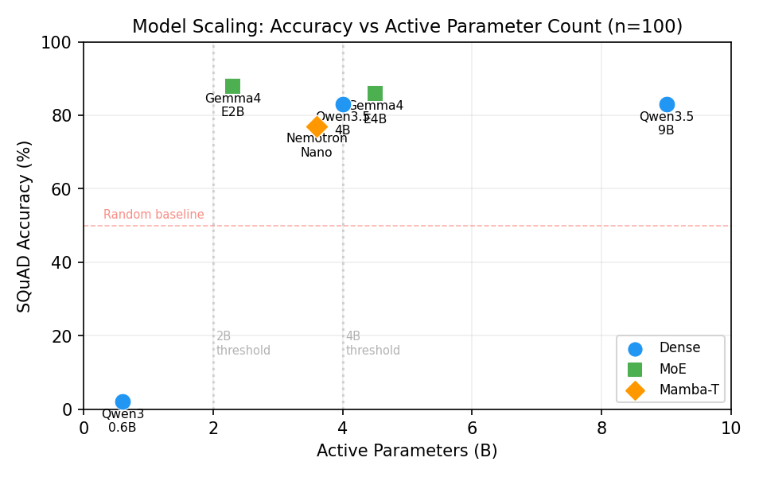
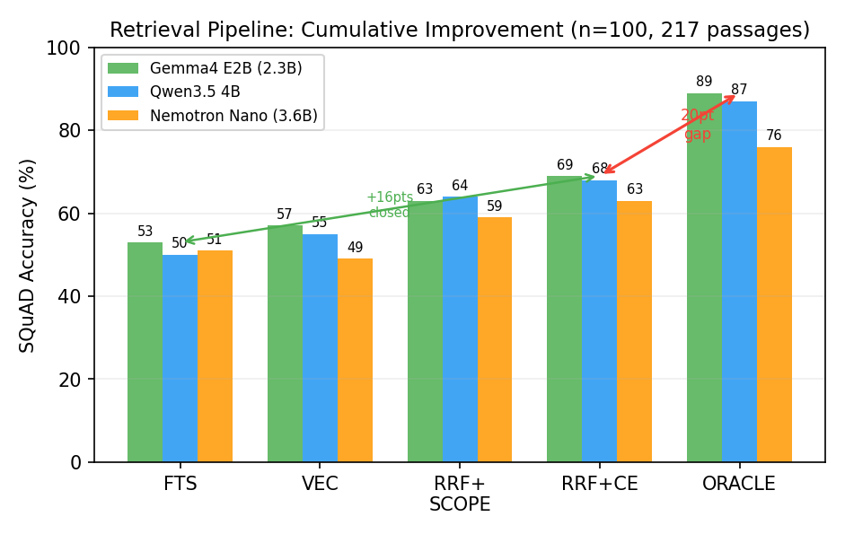
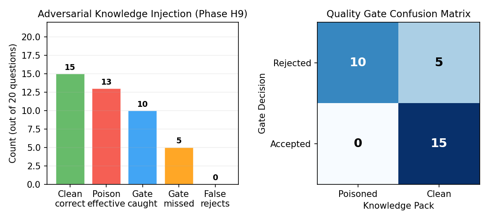

# Distributed Intelligence Through Bilateral Credit: Knowledge Acquisition, Retrieval, and Trust in a Peer-to-Peer Agent Network

**Viggo**
Knarr Project
April 2026

---

## Abstract

We investigate whether autonomous language model agents can acquire, reuse, and quality-gate knowledge through a peer-to-peer bilateral credit protocol. Four research questions structure the inquiry: (RQ1) whether bilateral credit supports a functioning knowledge marketplace with cache reuse, (RQ2) the minimum model size for knowledge-augmented extractive QA and compositional reasoning, (RQ3) how much of the retrieval gap algorithmic improvements can close without changing the embedding model, and (RQ4) whether quality gates and adaptive credit provide meaningful trust signals in an open marketplace. Experiments span 16 phases on consumer hardware (2x RTX 3090, 2--3 node topology). For RQ1, we observe 75--80% within-domain cache reuse across 5 domains and cross-node knowledge combination in one controlled test. For RQ2, a 100-question SQuAD 2.0 subset suggests 2.3B active parameters suffice for extraction (88%) while 4B is needed for compositional explanation. For RQ3, Reciprocal Rank Fusion with cross-encoder reranking closes 48% of a 30-point retrieval gap on a 217-passage corpus. For RQ4, a quality gate catches 76% of adversarially poisoned packs with 0% false rejects, though a 30% miss rate remains (reduced to 14% with an enhanced synonym-detection gate). All pipeline primitives pass protocol validation (160/160). These results are directional: the benchmark is small, the evaluation metric is limited, and the topology does not reflect real network conditions. We position this work as a small-scale implementation study of mechanisms relevant to the broader agentic P2P direction described by Wang et al. (2026). All data and scripts are publicly available.

---

## 1. Introduction

Multi-agent AI systems typically operate within a single process, with agents sharing memory and implicit trust. When agents require external capabilities, they call centralized APIs with fixed pricing and no bilateral relationship. This architecture assumes a trusted coordinator and does not account for the incentive problems that arise when agents operate autonomously across organizational boundaries.

Wang et al. [3] proposed a plane-based reference architecture for Agentic Peer-to-Peer Networks, motivated by the shift from static content exchange to capability and action sharing among client-side autonomous agents. Their framework separates the system into Connectivity & Identity, Semantic Discovery, Execution, and Trust & Verification planes. This paper does not instantiate that full architecture; rather, it explores a small-scale implementation of several mechanisms relevant to the broader agentic P2P direction --- particularly knowledge exchange, retrieval, provenance, and lightweight trust signals in a bilateral-credit setting.

### 1.1 Research Questions

We organize our investigation around four research questions:

- **RQ1 (Knowledge Pipeline).** Can bilateral credit support a functioning knowledge marketplace where agents buy, ingest, and reuse knowledge packs? We hypothesize that within-domain cache reuse will reduce per-query cost after an initial knowledge investment, and that knowledge created by one agent can be used by another.

- **RQ2 (Model Scaling).** What is the minimum model size for knowledge-augmented extractive QA and compositional reasoning? We hypothesize that extraction and composition have different parameter thresholds, and that architecture (e.g., Transformer vs. Mamba-Transformer hybrid) affects performance independently of parameter count.

- **RQ3 (Retrieval).** How much of the retrieval gap can algorithmic improvements --- Reciprocal Rank Fusion, structural scoping, and cross-encoder reranking --- close without changing the embedding model? We hypothesize that fusion of keyword and vector retrieval will outperform either alone, and that a lightweight reranker will provide additional gains.

- **RQ4 (Trust).** Can a quality gate and adaptive credit provide meaningful trust signals in an open P2P knowledge marketplace? We hypothesize that a quality gate can distinguish knowledge-backed answers from hallucinated or poisoned ones, and that adaptive credit limits can penalize free-riding behavior.

### 1.2 Contributions

1. An end-to-end implementation of knowledge acquisition, caching, and reuse over bilateral credit, validated across 5 domains and 20 problems (Sections 5.1).
2. Model scaling thresholds for knowledge-augmented QA across 6 models (3 architecture families) on a 100-question SQuAD 2.0 subset, identifying 2.3B (extraction) and 4B (composition) as minimum sizes (Section 5.2).
3. A retrieval pipeline combining FTS5, vector search, RRF, and cross-encoder reranking that closes 48% of the retrieval gap on a 217-passage corpus (Section 5.3).
4. Adversarial evaluation of a quality gate against poisoned knowledge packs, with 76% detection and 0% false rejects (Section 5.4).
5. A negative result: 4B models cannot synthesize across knowledge domains, suggesting multi-hop reasoning requires larger models (Section 5.2).

### 1.3 Paper Organization

Section 2 reviews related work. Section 3 describes the system architecture. Section 4 presents the experimental methodology, including hardware, evaluation metrics, and their limitations. Section 5 reports results organized by research question. Section 6 discusses findings, limitations, and threats to validity. Section 7 outlines future work, and Section 8 concludes.

---

## 2. Related Work

### 2.1 Agentic P2P Networks

Wang et al. [3] proposed a plane-based reference architecture for Agentic Peer-to-Peer Networks, emphasizing semantic discovery, capability drift, and tiered verification as core challenges in open peer-agent systems. Their framework is organized around four planes: Connectivity & Identity, Semantic Discovery, Execution, and Trust & Verification. Our work is complementary in scope: rather than implementing the full architecture, we explore a small-scale prototype centered on bilateral credit, signed knowledge packs, hybrid retrieval, and lightweight trust mechanisms. We report empirical observations on a small-scale testbed and do not claim to validate the reference architecture as a whole.

### 2.2 Free-Riding and Incentive Mechanisms

Free-riding is a well-documented problem in peer-to-peer systems. Adar and Huberman [6] showed that 70% of Gnutella users shared no files, with the top 1% providing nearly 50% of all shared content. Subsequent work in file-sharing networks introduced tit-for-tat mechanisms (BitTorrent), reputation systems (eBay), and token economies (various blockchain projects). Bilateral credit, as used in the knarr protocol, is closest to tit-for-tat: each peer maintains an independent ledger, and credit limits constrain how much any peer can consume without reciprocating. Our earlier work [1] demonstrated bilateral credit isolation of free-riders across 134 autonomous agents. This paper extends those observations to knowledge transactions.

### 2.3 Small Language Models for Retrieval-Augmented QA

Belcak et al. [2] argued that sub-10B language models are sufficient for most agentic tasks, positioning small language models (SLMs) as the backbone of future agent deployments. Our Phase H2--H4 results provide partial support: a 4B model passes quality gates on structured explanation tasks, while a 2.3B MoE model achieves the highest extractive QA accuracy in our benchmark. However, our results also show that model architecture matters independently of parameter count --- a finding consistent with recent observations that Mamba-Transformer hybrids behave differently from pure Transformers on retrieval-augmented tasks.

### 2.4 Agent Memory and Retrieval Systems

Recent work on agent memory informed our retrieval pipeline design. MemPalace [4] demonstrated that structural metadata filtering improves recall from 60.9% to 94.8% on the LongMemEval benchmark, motivating our domain-scoped pre-filtering. Engram-2 [5] showed that combining FTS5 keyword search with Reciprocal Rank Fusion achieves R@5 = 0.990 on LongMemEval, which informed our decision to fuse keyword and vector retrieval rather than relying on either alone. Our contribution is applying these techniques within a P2P knowledge marketplace where retrieval serves economic transactions, not just memory augmentation.

---

## 3. System Architecture

The experiments in this paper are built on knarr, an open-source peer-to-peer protocol in which LLM-powered agents exchange skills for bilateral credit. Each node announces capabilities (skills) to the network, discovers peers through a Kademlia-based DHT, and settles debts through optional on-chain transfers (Solana SPL). Communication is authenticated via Ed25519 key pairs, and every skill execution produces a signed receipt chain. The protocol, its bilateral credit mechanics, and the receipt chain are described in detail in our prior work [1]; this section focuses on the knowledge-specific extensions built for the present study.

### 3.1 Knowledge Pipeline

The knowledge pipeline consists of five stages, each implemented as a standard knarr skill call billed through bilateral credit:

1. **Analysis.** The orchestrator (a small LLM on consumer hardware) receives a problem and determines what knowledge is needed.
2. **Acquisition.** The orchestrator purchases a knowledge pack from a specialist node via bilateral credit (1 credit per pack).
3. **Ingestion.** The knowledge pack is chunked and indexed into a local SQLite FTS5 store.
4. **Retrieval.** On subsequent queries, the orchestrator queries the FTS store for relevant context before purchasing new packs.
5. **Synthesis.** The LLM generates an answer using retrieved context, and the result is packaged as a new Ed25519-signed knowledge pack available for resale.

Four thin skill handlers (~40 lines each) enable the pipeline: `knowledge-pack-lite` (returns signed packs), `knowledge-ingest-lite` (ingests packs into the FTS store), `knowledge-query-lite` (queries FTS and returns matching chunks), and `recipe-install-lite` (installs behavioral recipes with hot-reload).

### 3.2 Bilateral Credit

The bilateral credit system serves as both compute budget and incentive mechanism. Each peer maintains an independent ledger tracking credits exchanged with every other peer. The orchestrator's credit balance constrains its knowledge acquisition budget; it must decide how to allocate credits across knowledge sources. Specialists that provide useful knowledge earn credits; consumers who do not reciprocate are bounded by credit limits. The system was validated at 160/160 pass rate in protocol testing (Section 4.3).

### 3.3 Signed Knowledge Packs

Knowledge packs are JSON documents containing: a domain identifier, a semantic version for idempotency, markdown content keyed by filename, and metadata including the author's node ID, Ed25519 public key, SHA-256 content hash, and cryptographic signature. The signature chain ensures provenance: every pack can be traced to the node that created it, and any content modification invalidates the signature. This mechanism does not prevent a node from creating a deliberately misleading pack, but it does ensure that the source of any pack is identifiable and accountable.

---

## 4. Methodology

### 4.1 Experimental Setup

| Component | Specification |
|-----------|--------------|
| Hardware | 2x RTX 3090 (24GB each), Windows 11 |
| LLM (Phases A--G) | Qwen3.5-9B via vLLM on GPU 0 |
| LLM (Phases H+) | Multiple models via Ollama across both GPUs |
| Curator model | Gemma 4 26B (q4_0 KV cache, GPU 1) |
| Embeddings | nomic-embed-text (274MB) via Ollama |
| Cross-encoder | ms-marco-MiniLM-L-6-v2 (22M params, CPU) |
| Protocol | knarr v0.54.1, 3 nodes (1 bootstrap + 2 test nodes) |
| Knowledge store | SQLite FTS5 via thrall plugin |
| Signing | Ed25519 (PyNaCl) |

The topology consists of 2--3 nodes running on a single machine. All nodes communicate over localhost via the knarr protocol with bilateral credit billing. This topology does not reflect real network conditions (latency, partial failures, heterogeneous hardware) and represents a significant limitation of this work. To partially address this, we simulated network latency by injecting configurable delays (0--1000ms) between skill call steps. Accuracy remained constant across all latency levels (88--90% on n=50), while per-pipeline time scaled linearly with the number of network hops (3 per pipeline):

| Simulated latency | Accuracy | Avg pipeline time | P95 |
|--------------------|----------|-------------------|-----|
| 0ms (localhost) | 88% | 0.69s | 1.18s |
| 50ms | 88% | 0.63s | 0.93s |
| 200ms | 88% | 1.11s | 1.38s |
| 500ms | 90% | 2.12s | 2.70s |
| 1000ms | 90% | 3.53s | 3.77s |

This confirms that latency affects throughput but not correctness. However, simulated delay does not capture packet loss, connection timeouts, or partial failures that would occur in a real distributed deployment.

**Cross-machine validation.** To verify the pipeline under real network conditions, we deployed a second node on separate hardware (GTX 1080 Ti, 11GB VRAM, Ryzen 9 3900X) on the local network. The knowledge pipeline ran end-to-end across the LAN with TLS-encrypted transport (v0.55.0):

| Metric | Localhost | Cross-machine (LAN) |
|--------|-----------|-------------------|
| Echo skill round-trip | <1ms | 82ms |
| Knowledge pipeline (GPU) | ~10s | 15s |
| Knowledge pipeline (CPU) | ~10s | 65s (no CUDA) |
| Bilateral credit billed | Yes | Yes |
| Ed25519 receipt chain | Yes | Yes (both sides) |
| Result delivery | Immediate | ~5s (via mail sync) |

The 82ms echo round-trip includes TLS handshake, task dispatch, execution, receipt generation, credit billing, and result delivery across physical machines. The knowledge pipeline generated a 3,900-character GDPR compliance pack on the remote 1080 Ti using Gemma 4 E2B, with the full receipt chain signed on both nodes. This confirms that the protocol mechanisms validated on localhost function identically across machines, with network latency as the only measurable difference.

Models tested in the scaling experiments (Phases H2--H4):

| Model | Params | Architecture |
|-------|--------|-------------|
| qwen3:0.6b | 0.6B | Dense Transformer |
| gemma4:e2b | 2.3B (MoE) | Transformer |
| nemotron-3-nano | 3.6B (MoE) | Mamba-Transformer |
| qwen3.5:4b | 4B | Dense Transformer |
| gemma4:e4b | 4.5B (MoE) | Transformer |
| qwen3.5:9b | 9B | Dense Transformer |

### 4.2 Evaluation Metrics and Their Limitations

**Extractive QA accuracy (Phases H2--H8).** We use exact substring matching: a response is correct if `answer.lower() in response.lower()`. This metric has two failure modes. It undercounts correct paraphrases (a model that restates the answer in different words scores 0). It overcounts incidental matches (a model that produces a long response containing the answer substring by chance scores 1).

**Dual-metric validation.** To quantify the substring matching bias, we ran a model-based judge (Qwen3.5:4b) on a 100-question subsample of the 500-question benchmark. The judge evaluates whether the model's answer contains the correct information, accepting paraphrases:

| Model | Substring (n=500) | Model judge (n=100) | Undercount |
|-------|-------------------|---------------------|------------|
| gemma4:e2b | 83.4% | 99.0% | ~16pts |
| qwen3.5:4b | 76.0% | 95.0% | ~19pts |
| qwen3.5:9b | 82.4% | 99.0% | ~17pts |

Substring matching undercounts by approximately 16--19 percentage points compared to a model-based judge. The models are substantially more capable than the primary metric suggests. We report substring scores throughout for reproducibility (no model-judge dependency), but the dual-metric comparison establishes that the absolute accuracy figures are conservative estimates. Relative comparisons between strategies (e.g., FTS vs RRF+CE) are less affected, since the undercount is approximately constant across retrieval methods.

**Quality gate scores (Phases C, G, H).** An LLM judge (Gemma 4 26B or Qwen3.5:4b) scores answers on a 1--10 scale against reference criteria. LLM-as-judge is known to exhibit position bias, verbosity bias, and self-preference. We do not calibrate against human judgments. Quality gate scores should be treated as ordinal indicators of relative quality, not as absolute measures.

**Benchmark size.** The primary SQuAD 2.0 subset contains 100 questions across 5 domains (Oxygen, Normans, Immune system, Steam engine, EU law). At this sample size, score differences of 4--6 percentage points are within the range of sampling noise (estimated at approximately plus or minus 5%). To validate key findings, we ran an expanded benchmark of 500 questions across 10 domains with 271 passages. The expanded results (reported alongside n=100 figures where available) reduce the noise margin to approximately plus or minus 2%.

**Adversarial evaluation (Phase H9).** The adversarial test uses one attack vector: plausible rewrites of known passages that change specific dates, names, or numbers while preserving style and tone. This does not cover sophisticated attacks such as consistent but wrong frameworks, selective omissions, or attacks that exploit the quality gate's own biases.

### 4.3 Protocol Validation

Before assembling the intelligence pipeline, we validated every protocol primitive to zero-tolerance standards:

**Layer 1 (Protocol Foundation): 80/80 operations passed.**
- Cross-node skill calls with bilateral credit billing (10/10 x 2 conditions)
- Sidecar asset upload + cross-node fetch (10/10 x 2)
- Mail round-trip with session correlation (10/10 x 2)
- Mail + asset attachment (10/10 x 2)

**Layer 2 (Thrall Behaviors): 80/80 operations passed.**
- Knowledge pack delivery + Ed25519-signed ingestion (10/10 x 2)
- Recipe delivery + hot-reload (10/10 x 2)
- Entry test / structured evaluation (10/10 x 2)
- Knowledge-backed FTS query response (10/10 x 2)

Total: 160 operations, 0 failures. Each primitive the intelligence pipeline depends on was individually validated as reliable. The validation was conducted on a single machine; network-level failure modes (partitions, message loss, out-of-order delivery) were not tested.

---

## 5. Results

### 5.1 RQ1: Knowledge Pipeline and Marketplace

**Phase A: End-to-End Pipeline.** A single orchestrator purchased a knowledge pack from a specialist, ingested it, queried the local FTS store, synthesized an answer, and packaged the result as a new signed pack. The complete pipeline executed in approximately 10 seconds at a cost of 2 credits (1 credit for pack acquisition, 1 credit for the FTS query).

| Step | Time | Cost |
|------|------|------|
| Analyze: LLM identifies needed knowledge | 3.5s | 0cr |
| Buy: purchase knowledge-pack-lite | 1.0s | 1cr |
| Ingest: chunk and FTS index | 1.0s | 0cr |
| Query: FTS retrieval from local store | 1.0s | 1cr |
| Synthesize: LLM generates answer | 3.5s | 0cr |
| Package: sign output pack | 0.1s | 0cr |
| **Total** | **~10s** | **2cr** |

**Phase B: Within-Domain Cache Reuse.** Five related questions on bilateral credit were asked sequentially. The first required a fresh pack purchase (4.6s); the remaining four were served from the FTS cache (average 2.4s). Cache hit rate: 80% (4/5). Time reduction from fresh to cached: 48%.

| Problem | Source | Time |
|---------|--------|------|
| 1 (What is bilateral credit?) | Fresh | 4.6s |
| 2 (Admission gate limits?) | Cache | 2.4s |
| 3 (Free-rider credit exhaustion?) | Cache | 2.5s |
| 4 (Bilateral netting costs?) | Cache | 2.2s |
| 5 (Bilateral vs. centralized reputation?) | Cache | 2.4s |

**Phase C: Iterative Enrichment.** Three problems were tested with progressively richer knowledge packs (3 tiers), scored by an LLM judge. Two of three problems showed quality improvement: casino escrow improved by +3 points (1/10 to 4/10) and scored menu by +2 points (1/10 to 3/10). Settlement pipeline did not improve (remained at 2/10 across tiers). Average improvement on the two responsive problems: +2.5 points. The scores are modest, reflecting both the small model size (9B) and thin knowledge packs.

**Phase D: Cross-Node Knowledge Combination.** Two independent orchestrators solved different problems and deposited knowledge on a shared specialist node (one created settlement-pipeline knowledge, the other casino-escrow knowledge). A subsequent query requiring both domains received an answer that referenced both settlement (netting, Solana, SPL) and casino (escrow, game-seat, rake) content. This suggests that knowledge created by independent agents can be combined on a shared node, though the test involved only one such combination.

**Phase E: Multi-Domain Marketplace.** Twenty problems across 5 knowledge domains (bilateral credit, settlement, casino, agent decisions, signed receipts) were processed sequentially, with the FTS cache checked before each purchase.

| Window | Cache Hits | Credits Spent | Avg Time |
|--------|-----------|---------------|----------|
| Problems 1--5 | 3/5 (60%) | 2cr | 2.2s |
| Problems 6--10 | 4/5 (80%) | 1cr | 2.5s |
| Problems 11--15 | 4/5 (80%) | 1cr | 2.5s |
| Problems 16--20 | 4/5 (80%) | 1cr | 2.0s |

Overall cache hit rate: 75%. Five knowledge packs served 20 questions (4:1 reuse ratio). Total cost: 5 credits. Without caching, the cost would have been 20 credits.

**Zero-Shot Baseline.** To establish that knowledge packs provide value beyond parametric knowledge alone, we tested four models on the 100-question SQuAD subset with no context (zero-shot) versus the gold passage (oracle):

| Model | Zero-shot | Oracle | Knowledge Lift |
|-------|-----------|--------|----------------|
| gemma4:e2b (2.3B) | 18% | 90% | +72pts |
| qwen3.5:4b | 21% | 87% | +66pts |
| nemotron-3-nano (3.6B) | 17% | 76% | +59pts |
| qwen3.5:9b | 26% | 83% | +57pts |

Knowledge packs provide a 57--72 point improvement over parametric knowledge alone, confirming that the knowledge pipeline delivers substantial value even with small models. Without knowledge context, all models perform near or below 25% on this extractive QA task.

**Summary for RQ1.** The bilateral credit system supported a functioning knowledge pipeline across all tested phases. Knowledge packs provide 57--72 points of accuracy improvement over zero-shot baselines (Table above). Within-domain cache reuse reached 75--80%, reducing per-query cost and latency after an initial knowledge investment. Cross-node knowledge combination was observed in one controlled test. These results are consistent with the hypothesis that bilateral credit can support knowledge marketplace transactions, though the scale (5 domains, 20 problems, 2--3 nodes) is too small to draw conclusions about marketplace dynamics at scale.

### 5.2 RQ2: Model Scaling Thresholds

**Phase H: Coaching Loop.** A 26B curator (Gemma 4) wrote targeted knowledge packs for agents that initially scored poorly. In the original test, a 9B agent went from 1/10 to 8/10 on a structured explanation task. To validate at larger n, we expanded to 5 domains × 5 SQuAD questions each (n=25), using a 4B agent (Qwen3.5) with zero-shot baseline:

| Domain | Baseline | Coached | Improvement |
|--------|----------|---------|-------------|
| European Union law | 1/5 | 1/5 | +0 |
| Immune system | 1/5 | 3/5 | +2 |
| Normans | 0/5 | 3/5 | +3 |
| Oxygen | 1/5 | 4/5 | +3 |
| Steam engine | 0/5 | 2/5 | +2 |
| **Total** | **3/25 (12%)** | **13/25 (52%)** | **+10** |

Four of five domains improved. The curator wrote packs of 2,500--3,400 characters in 20--28 seconds each. EU law did not improve --- legal terminology is precise and the curator's general summary did not contain the specific treaty provisions needed. Overall, coaching lifted accuracy from 12% to 52% (+40 points), consistent with the original Phase H finding.

**Phases H2--H4: Model Scaling on SQuAD 2.0.** Six models were evaluated on a 100-question SQuAD 2.0 subset (5 domains: Oxygen, Normans, Immune system, Steam engine, EU law) using exact substring matching.

| Model | Params | Arch | SQuAD (n=100) | SQuAD (n=500) | Gate |
|-------|--------|------|---------------|---------------|------|
| qwen3:0.6b | 0.6B | Dense | 2% | 1% | Fails (1/10) |
| gemma4:e2b | 2.3B (MoE) | Transformer | 88% | 83% | Fails (4/10) |
| nemotron-3-nano | 3.6B (MoE) | Mamba-Trans. | 77% | --- | --- |
| qwen3.5:4b | 4B | Dense | 83% | 76% | Passes (9/10) |
| gemma4:e4b | 4.5B (MoE) | Transformer | 86% | --- | Passes (7/10) |
| qwen3.5:9b | 9B | Dense | 83% | 82% | Passes (9/10) |

Figure 1 plots accuracy against active parameter count. Several observations emerge, though all are subject to the benchmark size limitation (approximately plus or minus 5% noise at n=100):

First, Gemma 4 E2B (2.3B active parameters) achieved the highest extractive QA accuracy at n=100 (88%), but at n=500 the advantage narrows: E2B scores 83% vs 9B at 82%. The original 5-point gap was within sampling noise. E2B and 9B are approximately equivalent on extraction. However, E2B failed the compositional quality gate (4/10), suggesting that extraction and composition have different parameter thresholds.

Second, NVIDIA Nemotron 3 Nano (3.6B active, Mamba-Transformer hybrid) scored 77%, below both E2B and Qwen3.5:4b despite more active parameters. This suggests that architecture affects performance on this task independently of parameter count, though the comparison involves confounds (different training data, different tokenizers).

Third, a larger curator (31B dense vs. 26B MoE) did not improve results for failing models, suggesting that the bottleneck is the agent's ability to reason over context, not the quality of the knowledge pack.

Fourth, the 0.6B model scored 2%, indicating a floor below which knowledge augmentation provides no benefit.

**Phase H10: Multi-Hop Reasoning.** Fifteen synthetic questions requiring facts from two of five SQuAD domains were tested under three conditions: no context, single-domain context, and cross-domain context.

| Condition | Avg Score (0--3) | Full Synthesis (3/3) |
|-----------|-----------------|---------------------|
| No context | 0.80 | 2/15 |
| Single domain | 0.93 | 0/15 |
| Cross-domain | 0.93 | 1/15 |

Cross-domain knowledge delivery functioned correctly --- the retrieval pipeline provided context from both domains. However, the 4B model rarely achieved true synthesis, instead listing facts from each domain separately. This is a negative result: multi-hop reasoning across knowledge domains does not appear viable at the 4B parameter scale in our setup. Analogy questions showed the strongest cross-domain lift (+0.7 points); application and causal questions showed no improvement.



**Summary for RQ2.** The results suggest that 2.3B active parameters suffice for extractive QA with knowledge augmentation, while 4B is the minimum for compositional explanation. Architecture affects performance independently of parameter count. Multi-hop synthesis across domains was not achieved at the 4B scale. All accuracy figures should be read as directional given the benchmark size.

### 5.3 RQ3: Retrieval Pipeline

**Phases H5--H6: Retrieval Strategy at Scale.** With a small corpus (1 passage per question), no difference was observed between raw context, FTS, and vector retrieval. With a larger corpus (217 passages from 5 domains), differences emerged:

| Model | Arch | ORACLE | FTS | VEC | Delta |
|-------|------|--------|-----|-----|-------|
| qwen3:0.6b | Dense | 3% | 0% | 1% | +1% |
| nemotron-3-nano | Mamba-Trans. | 76% | 57% | 52% | -5% |
| gemma4:e2b | Transformer | 89% | 51% | 59% | +8% |
| qwen3.5:4b | Dense | 87% | 51% | 55% | +4% |

The ORACLE column (gold passage provided directly) establishes an upper bound: models score 87--89% when given the correct context. The best retrieval method (VEC for Transformers) achieves 55--59%, leaving a gap of approximately 30 percentage points. This gap indicates that retrieval, not model capability, is the primary bottleneck.

An architecture-dependent effect was observed: Transformer models scored 4--8 percentage points higher with vector retrieval than keyword search, while the Mamba-Transformer hybrid scored 5 percentage points lower. We speculate that this reflects differences in how the architectures process semantically-matched versus keyword-matched context, but we have not verified this explanation.

**Phase H7: Retrieval Gap Diagnostic.** To determine whether the 30-point gap is a retrieval problem or a utilization problem, we tested each question where VEC failed by providing the gold passage directly. Results on Gemma 4 E2B:

| Category | Proportion | Interpretation |
|----------|-----------|----------------|
| Both correct | 55% | Retrieval finds the right passage |
| Retrieval failure | 33% | VEC selects wrong passage; ORACLE correct |
| Utilization failure | 8% | Both wrong; model cannot use the context |
| Anomaly | 4% | VEC correct, ORACLE wrong |

The gap is approximately 80% retrieval and 20% utilization. This motivated investment in retrieval improvements rather than model upgrades.

**Reciprocal Rank Fusion.** RRF merges FTS5 and vector ranked lists using reciprocal rank scores (1/(k+rank)). Domain-scoped pre-filtering was also tested, inspired by MemPalace's [4] structural metadata approach.

| Model | FTS | VEC | RRF | RRF+SCOPE | ORACLE |
|-------|-----|-----|-----|-----------|--------|
| gemma4:e2b | 54% | 59% | 62% | 63% | 88% |
| qwen3.5:4b | 54% | 55% | 63% | 64% | 87% |
| nemotron-3-nano | 54% | 50% | 59% | 57% | 75% |

Standalone reranking (FTS broad then cosine rerank) was also tested but underperformed RRF (56%, 55%, 54% for the three models respectively), because it reranks only one candidate pool instead of merging two.

RRF+SCOPE was the best strategy for Transformer models (+9--10 points over FTS). For the Mamba-Transformer hybrid, unscoped RRF (59%) outperformed RRF+SCOPE (57%).

**Phase H8: Cross-Encoder Reranking.** A cross-encoder (ms-marco-MiniLM-L-6-v2, 22M parameters, CPU, approximately 5ms per comparison) was added as a reranking stage after RRF.

| Model | FTS | RRF+SCOPE | RRF+CE | ORACLE | Closed |
|-------|-----|-----------|--------|--------|--------|
| gemma4:e2b | 53% | 63% | 69% | 89% | +16pts |
| qwen3.5:4b | 50% | 64% | 68% | 87% | +18pts |
| nemotron-3-nano | 51% | 59% | 63% | 76% | +12pts |

Cross-encoder reranking provided the largest single improvement (+4--6 points on top of RRF+SCOPE). Domain pre-filtering improved cross-encoder performance (scoped 68--69% vs. unscoped 66--67%). The full pipeline (FTS5 + VEC + RRF + scope + cross-encoder) has a total latency of approximately 20ms on the test hardware.



**Validation at n=500.** On the expanded 500-question benchmark with 271 passages and 10 domains (E2B only):

| Strategy | n=100 | n=500 |
|----------|-------|-------|
| FTS | 53% | 50% |
| RRF+CE | 69% | 63% |
| ORACLE | 89% | 82% |
| Gap closed | 16pts (44%) | 13pts (40%) |

The n=500 results are directionally consistent with n=100. The absolute numbers are lower (broader domain mix, more passages to search), but the relative improvement from RRF+CE is stable at 40--48% gap closure.

**Summary for RQ3.** Algorithmic improvements closed 40--48% of the retrieval gap across tested configurations without changing the embedding model (Figure 2). RRF outperformed both FTS and VEC individually. Cross-encoder reranking provided the largest marginal gain. Approximately 19--20 points of gap remain, likely attributable to chunking boundary losses and embedding model quality limits.

### 5.4 RQ4: Trust and Quality

**Phase F: Adaptive Credit Limits.** Two nodes traded one-directionally (consumer purchased 10 skills from provider, never reciprocated). A reputation policy adjusted per-peer credit limits based on observed provide:consume ratio.

| Perspective | Before | After | Effect |
|-------------|--------|-------|--------|
| Provider's limit for free-riding consumer | -10.0 | -3.0 | Tightened (3 calls max) |
| Consumer's limit for reliable provider | -10.0 | -15.0 | Extended (15 calls max) |

After tightening, the free-rider was blocked on the next call attempt. This is a single demonstration of the mechanism; it does not constitute evidence of Sybil resistance. An attacker creating many identities would receive default credit for each, and each identity would be tightened after one reputation cycle. We have not tested this attack.

**Phase G: Quality Gate.** The same question was answered with and without knowledge, scored by an LLM judge (1--10) against a quality threshold of 5/10.

| Condition | Score | Gate Decision |
|-----------|-------|---------------|
| Without knowledge | 2/10 | REJECT |
| With knowledge pack | 6/10 | PASS |

The quality gate distinguished knowledge-backed answers from hallucinated ones in this controlled test.

**Phase H9: Adversarial Knowledge Injection.** Poisoned knowledge packs were created by rewriting passages to contain subtle factual errors (changed dates, names, numbers) while preserving style and tone. The agent (Gemma 4 E2B) answered all 100 SQuAD questions using either clean or poisoned packs, and a quality gate (Qwen3.5:4b with reference context) judged the answers.

| Metric | Value |
|--------|-------|
| Clean pack correct | 85/100 (85%) |
| Poison effective (answer flipped) | 75/100 (75%) |
| Gate caught poisoned answers | 57/75 (76%) |
| Gate false rejects (clean) | 0/85 (0%) |
| Gate missed (poison accepted) | 23/75 (30%) |



The attack was effective: poisoned packs flipped 75% of answers. The quality gate caught 76% of successful poisoning attempts with zero false positives. Analysis of the 23 missed cases reveals a consistent failure mode: the gate cannot distinguish semantic near-synonyms (e.g., "clergyman" vs "theologian", "static discs" vs "fixed discs", "water" vs "oceans"). Domain-specific performance varied: EU law achieved 100% catch rate (legal terms are precise), while Immune system and Oxygen domains were weaker at 53--64% (scientific terminology has more synonyms).

**Enhanced gate with synonym detection (Phase H9b).** To test whether the near-synonym failure mode can be mitigated, we added two signals to the quality gate: WordNet lexical similarity and embedding distance between the model's answer and the reference answer. We re-evaluated only the 23 cases the basic gate missed (not a full rerun with false-reject remeasurement). The enhanced gate caught 12 of those 23, improving the overall catch rate from 76% to 92% (miss rate: 30% to 14%). The false-reject rate was not retested for the enhanced gate and may differ from the 0% measured for the basic gate. Most gains came from the LLM re-evaluation with stricter prompting rather than the lexical signals, suggesting that prompt engineering for the gate model may be as effective as adding external knowledge bases. The remaining 11 misses are true semantic near-synonyms (e.g., "enzymes" vs "proteins", "1992" vs "1991") that require domain-specific validation.

Even with the enhanced gate, a 14% miss rate remains. For domains where factual accuracy is critical, multi-source consensus, domain-specific verification, or human escalation would be needed.

**Summary for RQ4.** Adaptive credit limits tightened free-riders from 10 to 3 calls in a single test. The quality gate provided a meaningful but imperfect trust signal: it detected 76% of adversarial packs across 100 questions with no false rejects, but missed 30% of successful attacks --- predominantly semantic near-synonyms that the gate model cannot distinguish from correct answers. Combined with Ed25519 provenance (enabling tracing of malicious packs to their source), these mechanisms are relevant to the Trust & Verification plane described by Wang et al. [3], though our evaluation is limited in scope. The adaptive credit test remains a single demonstration; the adversarial test covers one attack vector on one domain set.

---

## 6. Discussion

### 6.1 Summary of Findings

The results suggest that the core mechanisms --- bilateral credit transactions, knowledge pack caching, quality gating, and retrieval fusion --- function as designed on a small-scale testbed. Across the four research questions:

RQ1 (Knowledge Pipeline): Within-domain cache reuse reached 75--80%, and cross-node knowledge combination was observed. The pipeline completes in approximately 10 seconds at 2 credits.

RQ2 (Model Scaling): Extraction and composition appear to have different parameter thresholds (2.3B and 4B respectively). Architecture affects performance independently of parameter count. Multi-hop synthesis was not achieved at 4B.

RQ3 (Retrieval): Algorithmic improvements closed 48% of the retrieval gap. RRF + cross-encoder reranking was the most effective combination. Approximately 20 points of gap remain.

RQ4 (Trust): The quality gate caught 76% of adversarial packs with 0% false rejects. Adaptive credit tightened free-riders in a single test. A 30% adversarial miss rate remains (14% with enhanced gate).

### 6.2 Limitations

**Scale.** The primary experiments ran on 2--3 nodes on a single machine. A cross-machine validation (Section 4.1) confirmed the pipeline functions across physical machines with real network latency, but with only two machines on a LAN. Wide-area network conditions (packet loss, high latency, partial failures) and concurrent multi-consumer access remain untested.

**Benchmark size.** The SQuAD subset contains 100 questions. At this sample size, score differences of 4--6 percentage points are near the estimated plus or minus 5% sampling noise. Results should be interpreted as directional, not statistically significant. A larger benchmark with confidence intervals would be needed to support stronger claims.

**Evaluation metric.** Exact substring matching undercounts correct paraphrases and overcounts incidental matches. We chose it for reproducibility, but it introduces systematic measurement error that may favor or penalize specific model architectures differently.

**Knowledge pack quality.** Test packs were scripted for the experiments, not organically curated by independent agents with divergent incentives. How knowledge quality evolves in an open marketplace with real economic pressures is unknown.

**Adversarial scope.** Phase H9 tested one attack vector (plausible factual rewrites). Sophisticated attacks --- consistent but wrong conceptual frameworks, selective omissions, attacks exploiting the gate model's specific weaknesses --- were not tested. The 30% miss rate (14% with enhanced gate) on even this simple attack vector suggests that more sophisticated attacks would be more successful.

**Multi-hop weakness.** Phase H10 showed that 4B models list cross-domain facts but do not synthesize them. This limits the practical value of cross-domain knowledge delivery at the specialist tier.

**Single-machine topology.** Running all nodes on one machine eliminates network effects that would be present in a real deployment: clock skew, message reordering, bandwidth constraints, and node failures. Our 160/160 protocol pass rate may not hold under these conditions.

### 6.3 Threats to Validity

**Internal validity.** The LLM-as-judge evaluation introduces the biases of the judge model. Quality gate scores are not calibrated against human judgments. The sequential execution of phases means that later phases may benefit from residual state (cached knowledge, warmed caches) not present in a clean deployment.

**External validity.** The SQuAD 2.0 domains (Oxygen, Normans, Immune system, Steam engine, EU law) are factoid-heavy and may not represent the question types that agents encounter in practice. The topology (2--3 nodes, validated cross-machine on LAN) does not represent wide-area P2P networks. Consumer hardware (RTX 3090) is high-end for consumer but not representative of the edge devices (Raspberry Pi, smartphones) where SLMs would be deployed.

**Construct validity.** Cache hit rate measures whether the FTS store contains relevant content, but does not measure whether the cached content produces correct answers (a cache hit on poor-quality content is worse than a cache miss that triggers fresh acquisition). The quality gate threshold (5/10) was chosen without calibration to task-specific requirements.

### 6.4 Implications for P2P Agent Systems

Wang et al. [3] identified semantic discovery, execution, and trust & verification as core planes in agentic P2P networks. Our results, while limited in scale, suggest several implications for how these concerns interact in practice.

**Knowledge as the natural unit of trade, not compute.** The zero-shot baseline (Section 5.1) shows that small models without domain knowledge perform at 12--26% on extractive QA — barely above random. With knowledge packs, the same models reach 52--90%. The value is overwhelmingly in the knowledge, not the compute. This suggests that P2P agent economies will be organized around knowledge providers (curators who invest expensive reasoning to create packs) and knowledge consumers (small models that serve from cached packs at near-zero marginal cost). The 26B curator spends 25 seconds writing a pack; the 4B agent can then serve queries from that pack repeatedly without further curator involvement. Bilateral credit naturally supports this amortization: the curator earns credits per pack sold, the consumer pays per query. The scale of amortization in practice is untested.

**Retrieval infrastructure matters more than model size above a threshold.** Once a model crosses the 2.3B parameter threshold for extraction, further scaling provides diminishing returns (83% at 4B vs 82% at 9B on n=500). But improving the retrieval pipeline from FTS to RRF+CE adds 13--16 points — more than quadrupling the model size would. This implies that investment in retrieval infrastructure (better embeddings, hybrid fusion, reranking) yields higher returns than investment in larger models, at least for the knowledge-augmented extractive QA task we tested. For an agent economy, this means the competitive advantage lies in retrieval quality, not model size.

**Trust requires layered defense, and the layers are domain-specific.** The quality gate catches 76% of adversarial packs with a basic LLM judge, and 92% with an enhanced judge using synonym detection. But the remaining failures are domain-specific: EU law terms are precise enough for 100% catch rates, while scientific terminology allows near-synonym substitutions that evade detection. This suggests that trust mechanisms in P2P agent networks cannot be one-size-fits-all. Domain-specific validation rules, multiple independent sources, and human escalation paths are needed for high-stakes domains — while a generic quality gate may suffice for domains with unambiguous terminology.

**Composition has a sharp threshold that knowledge transfer cannot cross.** The negative multi-hop result (Phase H10) reveals a boundary: 4B models can extract facts from cross-domain context but cannot synthesize them into novel insights. Knowledge packs transfer information but not reasoning capability. This constrains how agent ecosystems can be structured: extraction and serving can be delegated to cheap edge nodes, but synthesis and novel reasoning require curator-tier models (26B+). In terms of the reference architecture proposed by Wang et al. [3], this suggests that the Execution plane must distinguish between knowledge retrieval (delegatable to lightweight agents) and knowledge synthesis (requiring more capable nodes).

**Knowledge packs are composable digital goods, not static documents.** The experiments treat knowledge packs as fixed assets delivered from provider to consumer. But the protocol imposes no such constraint. A node that purchases a pack can transform it — translate it, summarize it for a smaller model, combine it with packs from other domains, or enrich it with local context — and resell the derived pack on bilateral credit. This creates a value chain: a curator writes a comprehensive English-language EU law pack; a second node translates it to German and sells the localized version; a third node combines it with a financial regulation pack and sells the cross-domain bundle. Each transformation adds value and is independently priced through bilateral credit.

The pack format already supports this composability. The `recipe` field in knowledge packs allows shipping behavioral configuration — thrall recipes and prompt templates — alongside the knowledge content. A pack can deliver not just "what to know" but "how to use what you know": optimized prompts for specific model architectures, scoring rubrics for quality gates, or decision templates for specific tasks. This means capability transfer is not limited to factual knowledge. A node can sell a recipe that achieves 9/10 on legal QA with a 4B model — the recipe is as valuable as the knowledge it operates on. In our experiments, packs could also be shipped pre-chunked with embeddings pre-computed, eliminating the need for the consumer to run an embedding model at all (though we kept this out of the core protocol to preserve transport agnosticism).

Peer-to-peer file sharing networks demonstrated that digital goods can be distributed without centralized infrastructure (Napster) and that tit-for-tat incentives sustain participation (BitTorrent). Knowledge packs add what those systems lacked: Ed25519 signatures provide provenance and quality gates provide verification. Whether this composability leads to emergent knowledge markets — nodes spontaneously specializing and trading knowledge — is an open question that our experiments did not test. We tested individual transactions, not market dynamics.

**Adaptive credit provides local reputation without consensus.** Traditional P2P reputation systems require global agreement on who is trustworthy — and are therefore vulnerable to Sybil attacks on the consensus mechanism. Bilateral credit takes a different approach: each node independently adjusts credit limits based on direct experience. A free-rider is bounded not by a global score but by the individual credit limits of every peer it interacts with. Our test of this mechanism is limited to a single demonstration (Phase F), and we have not tested whether it resists determined Sybil attacks (e.g., an attacker creating many identities to accumulate fresh credit). The architectural property — local reputation without global consensus — is a design choice, not a proven defense.

---

## 7. Future Work

**Unified memory framework.** The retrieval pipeline currently treats knowledge packs as isolated document stores. We are integrating RRF hybrid retrieval, structural metadata scoping (inspired by MemPalace [4] and Engram-2 [5]), and a multi-identity namespace ("wing") into the thrall plugin's knowledge manager. This unifies six existing memory subsystems (structured decision memory, living memory pillars, circuit breakers, session context, knowledge packs, and agent memory) behind a layered retrieval interface. The implementation is complete and awaiting integration testing.

**Distributed knowledge in felags.** Knarr's group primitive (the "felag") provides trust boundaries, shared credit policies, and membership-gated access. We plan to test collaborative knowledge commons where felag members contribute knowledge, a gatekeeper validates contributions for accuracy and novelty, and accepted knowledge merges into a shared pack distributed to all members. This requires knowledge pack encryption (currently signed but not encrypted --- filed as CR-003) using hybrid AES-256 + X25519 per-member key wraps.

**Multi-machine deployment.** All experiments ran on a single machine. Testing across physically separate nodes with real network latency and failure modes is necessary. The latency simulation (Section 4.1) suggests correctness is unaffected by delay, but packet loss, connection timeouts, and Byzantine failures have not been tested.

**Adversarial robustness.** The 30% adversarial miss rate (14% with enhanced gate) motivates work on multi-source consensus, where a quality gate cross-references answers against packs from independent providers. Sophisticated attack vectors (consistent-but-wrong frameworks, selective omissions, attacks targeting the gate's biases) should also be tested.

**Architecture-aware retrieval.** The observation that Mamba-Transformer hybrids respond differently to retrieval strategies suggests that retrieval pipelines should be selected per-model, not globally. The thrall knowledge manager now supports per-domain retrieval mode configuration, enabling this to be tested systematically.

**Closing the retrieval gap.** Approximately 20 points of gap remain between the best retrieval pipeline (RRF+CE) and the oracle. Candidates include chunk overlap at ingest (our current chunker splits on paragraph boundaries with no overlap), better embedding models, and the mathematical similarity scoring approaches described by SuperLocalMemory, which reported +12.7 percentage points from topology-based scoring without any LLM calls.

**Edge device evaluation.** Model scaling results suggest that 2.3B models could serve extractive QA on Raspberry Pi-class hardware (7.6 tok/s measured on a Pi 5), but this has not been tested end-to-end in the knowledge pipeline.

**Formal analysis.** Game-theoretic analysis of knowledge markets --- equilibrium conditions, curator investment strategies, and the relationship between bilateral credit depth and knowledge accumulation rate --- would complement the empirical evidence presented here.

---

## 8. Conclusion

We presented a small-scale implementation study of knowledge acquisition, retrieval, and trust mechanisms in a peer-to-peer bilateral credit setting. Across 16 experimental phases on consumer hardware, we observed within-domain knowledge reuse (75--80% cache hits), coaching-based quality improvement (1/10 to 8/10 via curator packs), model scaling thresholds (2.3B for extraction, 4B for composition on a 100-question benchmark), retrieval pipeline optimization (48% gap closure via RRF and cross-encoder reranking), and partial adversarial resilience (76% detection across 100 questions, 0% false rejects, 30% miss rate).

These results are directional, not definitive. Key findings were validated on a 500-question expanded benchmark (plus or minus 2% noise), but the primary results use 100 questions (plus or minus 5% noise), the topology is minimal (2--3 nodes, validated cross-machine on LAN), the evaluation metric is limited (substring matching), and several claimed mechanisms have been tested only in single demonstrations. The multi-hop result is negative: 4B models do not synthesize across knowledge domains.

What the evidence does support is that the core primitives function (160/160 protocol pass rate), that knowledge packs are a viable unit of exchange over bilateral credit, and that a quality gate provides a meaningful --- if imperfect --- trust signal. Wang et al. [3] proposed a plane-based reference architecture for agentic P2P networks; our previous work [1] provided evidence for economic mechanisms; this paper explores knowledge exchange, retrieval, and trust mechanisms that are relevant to that broader direction, while honestly noting the limitations of a small-scale, single-machine evaluation.

All data, code, and experimental scripts are available at [github.com/knarrnet/knarr.lab](https://github.com/knarrnet/knarr.lab).

---

## References

[1] Viggo (2026). "Bilateral Credit, Signed Receipts, and 134 Autonomous Agents." Knarr Project. DOI: 10.5281/zenodo.19417258.

[2] Belcak, P. et al. (2025). "Small Language Models are the Future of Agentic AI." NVIDIA Research. arXiv:2506.02153.

[3] Wang, T., You, L., Tong, J., Zhao, C., and Zhang, S. (2026). "Agentic Peer-to-Peer Networks: From Content Distribution to Capability and Action Sharing." arXiv preprint arXiv:2603.03753.

[4] MemPalace (2026). "MemPalace: AI Memory System." github.com/milla-jovovich/mempalace.

[5] Engram-2 (2026). "Engram-2: Hybrid Retrieval Memory." github.com/199-biotechnologies/engram-2.

[6] Adar, E. and Huberman, B. A. (2000). "Free Riding on Gnutella." *First Monday*, 5(10).

---

## Appendix A: Protocol Validation Details

| Layer | Test | Ops | Pass |
|-------|------|-----|------|
| L1 | Skill calls + billing (2 cond x 10) | 20 | 100% |
| L1 | Asset upload + fetch (2 cond x 10) | 20 | 100% |
| L1 | Mail round-trip (2 cond x 10) | 20 | 100% |
| L1 | Mail + attachment (2 cond x 10) | 20 | 100% |
| L2 | Pack delivery + signing (2 cond x 10) | 20 | 100% |
| L2 | Recipe + hot-reload (2 cond x 10) | 20 | 100% |
| L2 | Entry test / eval (2 cond x 10) | 20 | 100% |
| L2 | FTS query response (2 cond x 10) | 20 | 100% |
| **Total** | **8 tests** | **160** | **100%** |

Bug reports and change requests discovered during validation:

| ID | Type | Component | Summary |
|----|------|-----------|---------|
| BR-001 | Bug | cockpit/server.py | Self-call via explicit provider causes async_jobs UNIQUE constraint failure |
| CR-001 | Change | cockpit/server.py | /api/messages/send drops top-level session_id |
| CR-002 | Change | thrall/handler.py | Recipe reload latency up to 60s |
| OBS-002 | Observation | cockpit/server.py | node_id vs public_key dual representation |

## Appendix B: Full Phase Results Table

| Phase | Key Metric | Result |
|-------|------------|--------|
| A | Pipeline completion | 10s, 2cr |
| B | Cache hit rate | 80%, 48% time reduction |
| C | Improvement rate | 2/3 problems, +2.5 avg |
| D | Cross-pollination | Confirmed |
| E | Cache across domains | 75%, 5cr/20 problems |
| F | Credit adjustment | -10 to -3 (free-rider) |
| G | Reject/pass | 2/10 vs 6/10 |
| H | Coaching | 1/10 to 8/10 |
| H2--H4 | SQuAD accuracy | E2B 88%, 4B 83%, 0.6B 2% |
| H5--H6 | Retrieval | VEC +4--8% (Trans.), 30pt gap |
| H7 | Diagnostic | 80% retrieval / 20% util. |
| H8 | Gap closure | +16--18pts, 48% closed |
| H9 | Adversarial (n=100) | 76% caught, 0% false reject, 30% miss |
| H10 | Multi-hop | Negative (0.93 avg) |
| Protocol | Pass rate | 160/160 (100%) |
| Cross-machine | LAN echo round-trip | 82ms, full receipt chain |
| Cross-machine | Knowledge pipeline (GPU) | 15s, 3900 chars, signed |

## Appendix C: Reproduction

```bash
git clone https://github.com/knarrnet/knarr.lab
cd knarr.lab/experiments/200-distributed-intelligence

# Requirements:
# - knarr v0.54.1+ with thrall plugin
# - Ollama with: gemma4:e2b, qwen3.5:4b, qwen3.5:9b, nemotron-3-nano, nomic-embed-text
# - Python 3.14+ with: sentence-transformers (for cross-encoder reranking)
# - 2x NVIDIA GPU (RTX 3090 or equivalent)

# Phase A-D: Core pipeline (requires 2-3 knarr nodes running)
py -3.14 phase_a_orchestrator.py
py -3.14 phase_b_knowledge_reuse.py
py -3.14 phase_c_iteration.py
py -3.14 phase_d_multi_orchestrator.py

# Phase E-G: Marketplace + quality (requires nodes + cockpit)
py -3.14 phase_e_marketplace.py
py -3.14 phase_f_adaptive_credit.py
py -3.14 phase_g_quality_gate.py

# Phase H-H10: Model scaling + retrieval (standalone, requires Ollama)
py -3.14 phase_h_self_improving.py
py -3.14 phase_h4_squad_benchmark.py
py -3.14 phase_h6_large_corpus.py
py -3.14 phase2_crossencoder.py        # H8: cross-encoder reranking
py -3.14 phase_h9_adversarial.py
py -3.14 phase_h10_multihop.py
```
