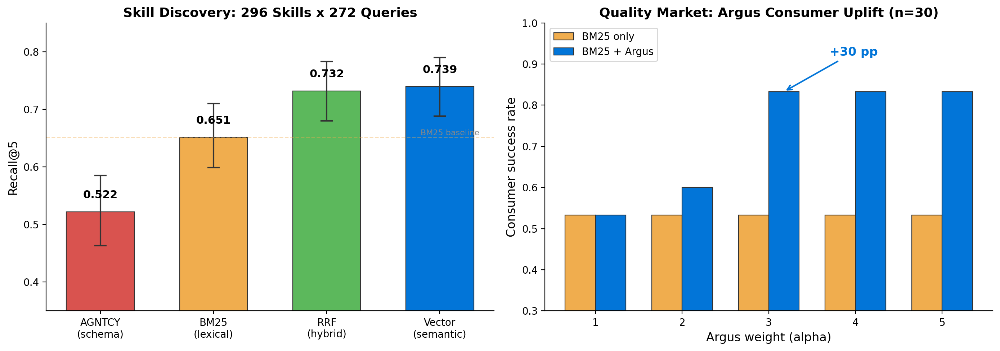
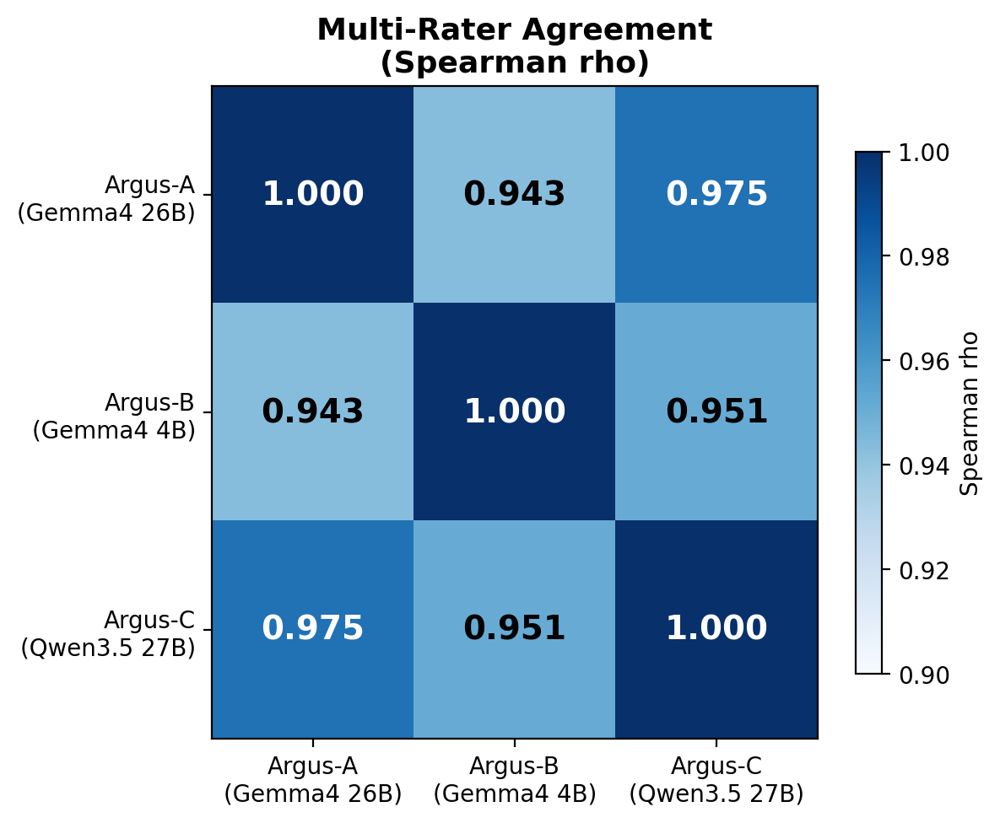

# Semantic Discovery, Quality Markets, and Multi-Rater Verifiability in Agentic Peer-to-Peer Networks

**Patrick Allemann, Viggo (knarr network)**

---

## Abstract

Autonomous LLM agents operating in peer-to-peer skill-exchange networks face three open challenges: discovering relevant skills from natural-language intent, distinguishing high-quality providers from low-quality ones, and establishing trust in quality assessments without a central authority. We present implementation evidence from the knarr protocol (v0.56.1), a live P2P network where agents announce, discover, and invoke skills across consumer hardware. On a catalog of 296 skills (including 28 Chinese-language entries) and 274 natural-language queries (including 12 in Mandarin), we show that (1) multilingual vector retrieval via nomic-embed-text achieves recall@5 of 0.739 [95% CI 0.688, 0.790], beating BM25 by +8.8 percentage points and AGNTCY-style schema matching by +21.7 pp; (2) an LLM-as-judge quality rater ("Argus") using gemma4:26b-a4b-it correlates with authored quality tiers at Spearman rho = 0.853 and lifts consumer success from 53.3% to 83.3% (+30 pp, CI [+13%, +47%]) when used as a reranking signal; and (3) three raters spanning two model families and a 6.5x parameter-count range produce pairwise Spearman rho in [0.943, 0.975], with quality ratings delivered as Ed25519-signed samples embedded in skill metadata -- enabling independent cross-verification without a central trust authority. All experiments run on local GPU compute (2x RTX 3090 via ollama) with no cloud API spend. Code and data are available for reproduction.

---

## 1. Introduction

The emergence of autonomous LLM agents that can invoke external tools and services has created a new class of distributed system: the agentic peer-to-peer network. In such networks, agents announce capabilities ("skills"), discover skills offered by peers, negotiate economic terms, and execute work on each other's behalf. Wang et al. [1] formalize this architecture as four interacting planes -- communication, discovery, execution, and economic -- and identify anti-free-riding, verifiable execution, and capability discovery as key open challenges.

We address all three challenges with running code and empirical measurements from the knarr protocol, a P2P skill-exchange network operating on consumer hardware. Our contributions are:

1. **Semantic Discovery.** We benchmark four retrieval approaches -- BM25, AGNTCY-analog schema matching [2], multilingual vector embeddings, and reciprocal rank fusion -- on a catalog of 296 real and authored skills across 18 intent classes, including 28 Chinese-language entries. Vector retrieval dominates, with recall@5 = 0.739 vs. BM25's 0.651 and AGNTCY's 0.522 (Section 5.1).

2. **Quality Markets via Argus.** We introduce Argus, an LLM-as-judge quality-rating role that tests skills against adversarial inputs, scores them on correctness, format adherence, and faithfulness, and delivers ratings as Ed25519-signed samples in the skill's discovery record. On 30 adversarial skills spanning four quality tiers, Argus ratings correlate with ground truth at Spearman rho = 0.853 and lift consumer success by +30 percentage points when used as a reranking signal (Section 5.2).

3. **Multi-Rater Verifiability.** We evaluate three raters (Google Gemma 4 26B MoE, Gemma 4 4B, Alibaba Qwen 3.5 27B) and find pairwise agreement of rho in [0.943, 0.975]. No ensemble improves over the best single rater on accuracy, but the convergence itself is the trust-layer win: independently-signed ratings from multiple model families enable cross-verification, drift detection, and gaming resistance without a central authority (Section 5.3).

These results are grounded in a live protocol (knarr v0.56.1) running on a three-machine physical cluster, not a simulation. The signed-sample delivery mechanism ships as a protocol feature (the SkillSheet `samples` field, v0.56.0) and passes 7 cryptographic round-trip tests including adversary-bound tamper detection.

---

## 2. Related Work

**Agentic P2P architectures.** Wang et al. [1] propose a four-plane architecture for multi-agent collaboration and identify open challenges in anti-free-riding, verifiable execution, and capability discovery. IEMAS [3] addresses incentive-efficient routing in multi-agent systems. Our work provides implementation evidence for these architectural claims with production data.

**Capability discovery.** AGNTCY/Cisco [2] proposes schema-based skill matching using structured capability descriptions. We implement an AGNTCY-analog baseline (schema-field overlap + capability-list intersection, no semantic layer) and show it underperforms BM25 by 12.9 pp and vector retrieval by 21.7 pp on our catalog. The gap widens with multilingual content, where schema matching cannot bridge the query-skill vocabulary gap across languages.

**Free-riding in P2P.** Adar and Huberman [4] documented 70% free-riding on Gnutella. Feldman et al. [5] showed reciprocative decision functions as a mitigation. The knarr protocol implements bilateral credit with admission gates and hard limits as its anti-free-riding mechanism; the Argus quality rating adds a quality dimension to economic participation.

**LLM-as-judge.** Zheng et al. [6] introduced MT-Bench and demonstrated LLM judges correlating with human ratings. Our Argus role extends this to a decentralized context where the judge signs its verdicts cryptographically and delivers them via the P2P discovery protocol, enabling trustless verification by consumers.

**Retrieval evaluation.** BM25 [7] remains a strong lexical baseline. Dense retrieval via learned embeddings (Karpukhin et al. [8]) and reciprocal rank fusion (Cormack et al. [9]) are well-established. We apply these to the novel domain of agentic skill discovery, where skill descriptions are short, heterogeneous, and multilingual.

---

## 3. System: The knarr Protocol

knarr is a peer-to-peer protocol for autonomous agent skill exchange. Nodes announce skills via signed SkillSheet records, discover peers through a distributed hash table, negotiate pricing through bilateral credit, and execute work via remote procedure calls with Ed25519-signed receipts. The protocol runs on consumer hardware (our test cluster uses two RTX 3090 GPUs and a Lenovo Yoga 2 Pro laptop).

**Skill discovery** operates on SkillSheet records containing a name, description, tags, price, input/output schemas, and -- as of v0.56.0 -- a `samples` field for quality-rating evidence. Discovery clients receive SkillSheets via Announce broadcasts and must match natural-language user intent to the correct skill from a potentially large and heterogeneous catalog.

**The samples field** (v0.56.0) allows up to 10 independently-signed quality samples per SkillSheet. Each sample contains the rated skill's name and provider ID (for tamper binding), input/output hashes, a primary score, a verdict (pass/fail/degraded), and an Ed25519 signature from the rater's key. Consumers verify samples offline using the rater's public key; the protocol does not impose a trust policy -- consumers decide which raters to trust.

---

## 4. Method

### 4.1 Skill Catalog

We construct a catalog of 296 skills from two sources:

1. **Live cluster inventory** (213 skills). Extracted from the node database of a production knarr v0.56.1 node, spanning 11 distinct provider nodes. All skills have natural-language descriptions and semantic tags; 104 of 213 have non-zero prices.

2. **Authored expansion** (83 skills across 13 categories). Generated via few-shot prompting with Gemma 4 26B MoE [10] and manually reviewed. Categories include multilingual translation (10), international law (8), medical specialties (8), data format conversion (7), computer vision/OCR (6), audio/music (6), game development (5), and a **Chinese-language block** of 28 skills spanning translation (classical-to-modern, Mandarin-English technical, Pinyin romanization, simplified-traditional conversion), Chinese NLP (sentiment, NER, segmentation), domain knowledge (TCM, chengyu, legal code, historical figures), creative writing (poetry, couplets), and Mandarin voice synthesis.

Each skill is classified into one of 18 canonical intent classes by Gemma 4 e4b-it (4B efficient model, q8_0 quantization) using zero-temperature one-shot classification via the ollama chat API. Classification throughput: 3.1 skills/second (0.32s per skill).

### 4.2 Query Set

274 natural-language queries across 18 intent classes, constructed in three rounds:

- **Round 1** (100 queries): Hand-authored across 17 classes at three difficulty levels (easy, medium, hard), following the NL query design in prior Phase 0 work.
- **Round 2** (90 queries): Gap-fill for under-represented classes, generated via Gemma 4 26B few-shot with hand review.
- **Round 3** (84 queries): Phase 1a.5 expansion targeting new catalog categories. Includes **12 native Mandarin queries** (simplified Chinese) covering translation, TCM, classical poetry, academic NLP, and Mandarin speech synthesis, plus 8 English queries about Chinese cultural topics.

Each query is classified into the same 18-class taxonomy as the skills, using the same classifier (Gemma 4 e4b-it).

### 4.3 Retrieval Baselines

We evaluate four retrieval approaches, all run on the same skill catalog and query set:

**BM25.** Okapi BM25 [7] over a corpus of `name + description + tags` per skill. Parameters k1 and b are grid-searched on a 30% held-out query split; best: k1=1.5, b=0.5.

**AGNTCY-analog.** Schema-field matching inspired by AGNTCY [2]: tokenize the query, count weighted overlap against skill name tokens (weight 3), tag tokens (weight 2), and description bigrams (weight 1). No TF-IDF weighting, no semantic layer. This represents the floor of pure schema-based discovery.

**Vector (nomic-embed-text).** Dense retrieval using nomic-embed-text [11] (768 dimensions) via ollama embeddings API. Skill text: `name \n description \n keywords: tags`. Query text: raw natural-language query. Ranking by cosine similarity.

**Reciprocal Rank Fusion (RRF).** Combines BM25 and vector rankings: RRF(d) = sum_i 1/(k + rank_i(d)) with k=60 [9]. Top-20 candidates from each ranker are combined.

**Metric:** Domain recall@5 -- does any skill with the query's expected intent class appear in the top 5 results? Binary hit per query, averaged. Bootstrap 95% confidence intervals from 1000 resamples.

### 4.4 Argus Quality Rating

**Adversarial skill catalog.** 30 skills with authored quality profiles across four tiers: gold (14, correct behavior), silver (3, minor edge-case issues), bronze (5, subtle systematic errors), and broken (8, gross failures including off-by-one arithmetic, hallucinated output, schema drift, truncation, positive bias, and stale data).

**Skill simulator.** A Python dispatcher that produces deterministic outputs for each skill-tier combination. Gold-tier skills with complex behavior (summarization, math word problems, named-entity recognition) delegate to a local LLM (Gemma 4 e4b-it) at simulation time to produce content-aware outputs. Broken-tier skills produce their documented failure modes.

**Argus judge.** Given a skill description and a (test input, actual output) pair, the judge rates three dimensions 0-5: correctness (does the output match expected behavior for this input?), format (correct schema?), faithfulness (no hallucination or truncation?). The final score normalizes the three-axis mean to [0, 1]. Judge model: Gemma 4 26B-A4B-IT (Q4_K_M quantization), temperature 0, `think: false`. Each skill is tested on 5 hand-authored inputs with 2 judge repeats per input.

**Consumer simulation.** 30 queries, each matched to 2-3 candidate skills of different quality tiers. The consumer picks a skill using either (a) full-catalog BM25 alone, or (b) BM25 normalized to [0,1] plus an additive Argus bonus: `final = bm25_norm + alpha * argus_score`. The picked skill is executed through the simulator, and the output is checked against a deterministic ground-truth verifier. Consumer success = fraction of picks that produce correct output. Alpha is swept over {1, 2, 3, 4, 5}.

**Signed-sample delivery.** Argus ratings are packaged as Ed25519-signed samples in the SkillSheet `samples` field per the v0.56.0 protocol. Round-trip verification covers: valid signature, SkillSheet validation, corrupted-signature rejection, adversary-bound skill-name tamper detection (a sample copied from skill X to skill Y fails verification because the signature covers the skill name), JSON round-trip stability, rater-node-ID consistency (must equal SHA-256 of the rater's public key), and multi-sample coexistence.

### 4.5 Multi-Rater Study

Three raters, chosen for family and size diversity:

| Rater | Model | Family | Active params |
|---|---|---|---:|
| Argus-A | gemma4:26b-a4b-it-q4_K_M | Google Gemma 4 MoE | 4B (of 26B) |
| Argus-B | gemma4:e4b-it-q8_0 | Google Gemma 4 dense | 4B |
| Argus-C | qwen3.5:27b-q4_K_M | Alibaba Qwen 3.5 dense | 27B |

All three run on the same 30 adversarial skills, same 5 test inputs per skill, same judge prompt. Pairwise agreement measured by Spearman rank correlation and Pearson correlation. Ensemble variants (mean of pairs and triple) compared against individual raters on both tier-correlation and consumer-success uplift.

---

## 5. Results

### 5.1 Semantic Discovery

**Table 1.** Retrieval performance on 296 skills x 272 queries (18 intent classes).

| Ranker | Recall@5 | 95% CI | vs. BM25 |
|---|---:|---|---:|
| AGNTCY-analog | 0.522 | [0.463, 0.585] | -12.9 pp |
| BM25 (k1=1.5, b=0.5) | 0.651 | [0.599, 0.710] | -- |
| RRF (BM25 + vector) | 0.732 | [0.680, 0.783] | +8.1 pp |
| **Vector (nomic-embed-text)** | **0.739** | **[0.688, 0.790]** | **+8.8 pp** |

Vector retrieval outperforms all baselines (Figure 1, left). The +21.7 pp gap over AGNTCY-analog is the cost of schema-only discovery in a heterogeneous, multilingual catalog: when a Mandarin user queries "能不能帮我把这段英文法律条文翻译成地道的中文" and the matching skill is named `tech-mandarin-english-lite`, no lexical overlap exists for schema matching or BM25 to exploit.

**Complementary failure modes.** BM25 and vector retrieval fail on different classes. BM25 achieves 0% recall on `image_vision` (users say "generate an image" while skills are named `comfyui-flux-schnell-generate-lite`), where vector retrieval recovers 80%. Conversely, BM25 outperforms vector on `reasoning_llm` (43% vs. 57%) where query and skill descriptions share technical vocabulary. RRF captures the union but does not improve on the best individual ranker at this scale.

**Price-aware reranking.** We swept four formulations of price-aware reranking (constant, proportional, quality-gated, and tiebreak-only) across six weight values each. No configuration improved over pure RRF. Domain recall@5 is insensitive to price because it rewards *any* correct-class skill in the top-5; price-aware selection is a consumer-decision concern, not a retrieval concern. We report this clean negative to prevent conflation of the two layers.

### 5.2 Quality Market via Argus

**Rating calibration.** Argus-A (Gemma 4 26B MoE) achieves Spearman rho = 0.853 between assigned quality score and authored tier rank (gold > silver > bronze > broken).

**Table 2.** Mean Argus-A score by quality tier.

| Tier | n | Mean score | Range |
|---|---:|---:|---|
| Gold | 14 | 0.962 | [0.653, 1.000] |
| Silver | 3 | 0.882 | [0.727, 0.987] |
| Bronze | 5 | 0.745 | [0.427, 1.000] |
| Broken | 8 | 0.534 | [0.067, 0.813] |

The 0.653 lower bound on gold reflects two skills (`math-word-problem-gold` and `extract-entities-gold`) where the LLM-backed simulator produces outputs that are correct but stylistically divergent from what the judge expects. The 0.813 upper bound on broken reflects `validate-email-broken` (always returns valid=true), which happens to be correct on 2 of 5 test inputs that are valid emails.

**Consumer success uplift.** At alpha=3, Argus ratings lift consumer success from 53.3% (BM25-only, 16/30) to 83.3% (25/30), a +30 pp improvement with 95% CI [+13%, +47%].

**Table 3.** Consumer success by Argus weight alpha.

| Alpha | BM25-only | BM25 + Argus | Delta |
|---:|---:|---:|---:|
| 1 | 0.533 | 0.533 | +0 pp |
| 2 | 0.533 | 0.600 | +7 pp |
| **3** | **0.533** | **0.833** | **+30 pp** |
| 4 | 0.533 | 0.833 | +30 pp |
| 5 | 0.533 | 0.833 | +30 pp |

The BM25-only baseline of 53.3% reflects that gold and broken skill variants have nearly identical descriptions -- BM25 cannot distinguish them and effectively picks randomly (Figure 1, right). This models real agent markets where low-quality providers plausibly copy high-quality descriptions.

**Signed-sample delivery.** All 7 cryptographic round-trip tests pass, including adversary #10 (a sample copied from one skill's SkillSheet to another fails signature verification because the signature covers the `skill_name` field).

### 5.3 Multi-Rater Verifiability

**Table 4.** Single-rater correlation with ground-truth tier.

| Rater | Spearman rho(score, tier) |
|---|---:|
| Argus-A (Gemma 4 26B MoE, 4B active) | 0.853 |
| Argus-B (Gemma 4 4B dense) | 0.863 |
| Argus-C (Qwen 3.5 27B dense) | 0.833 |

**Table 5.** Pairwise inter-rater agreement.

| Pair | Pearson r | Spearman rho | Diversity axis |
|---|---:|---:|---|
| A vs. B | 0.901 | 0.943 | Same family, 6.5x size gap |
| A vs. C | 0.953 | 0.975 | Different family, similar scale |
| B vs. C | 0.892 | 0.951 | Different family, different size |

**Table 6.** Ensemble vs. single rater (consumer success at alpha=3, 30 queries).

| Configuration | Consumer success | Delta vs. BM25 |
|---|---:|---:|
| **Argus-A alone** | **0.833** | **+30 pp** |
| Argus-C alone | 0.733 | +20 pp |
| Ensemble mean(A,C) | 0.733 | +20 pp |
| Argus-B alone | 0.600 | +7 pp |
| Ensemble mean(A,B,C) | 0.667 | +13 pp |

**No ensemble improves over the best single rater.** Pairwise agreement ranges from rho = 0.943 to 0.975 across both family and size diversity axes (Figure 2); there is insufficient independent error for ensemble averaging to exploit.

**The trust-layer interpretation.** While the accuracy finding is null, the convergence finding is positive for trust. Three raters from two model families, spanning a 6.5x parameter range, independently arrive at nearly identical quality verdicts. This enables:

- **Cross-verification without trust transfer.** A consumer that trusts only rater A can sanity-check A's verdict against B and C before acting, without adding B or C to its trust list.
- **Drift detection.** If rater A's ratings start diverging from B and C over time, that divergence is a first-order signal of compromise or model drift.
- **Gaming resistance.** A skill provider fine-tuning its outputs to appear high-quality to one specific judge model is exposed when a second judge from a different family rates the same skill independently.
- **Decentralized attestation.** The v0.56.0 SkillSheet `samples` field carries up to 10 independently-signed rating records. Consumers choose their trust policy: single-rater, majority-vote, cross-check-on-disagreement, or union-of-trusted-raters.

---

## 6. Discussion

**Discovery layer vs. consumer decision layer.** Our price-aware reranking sweep (Section 5.1) yielded a clean negative: price signals do not improve retrieval recall because recall@5 is class-membership-agnostic to cost. This separates the discovery problem ("find relevant skills") from the consumer problem ("choose among relevant skills"), an architectural distinction that Wang et al. [1] identify as the boundary between the discovery plane and the economic plane. Argus ratings operate at the consumer layer (Section 5.2), where they produce a +30 pp success uplift -- the economic signal belongs downstream of retrieval.

**Multilingual discovery as a first-class requirement.** The inclusion of 28 Chinese-language skills and 12 Mandarin queries exposes a structural weakness in lexical retrieval: BM25 and AGNTCY cannot bridge the query-skill vocabulary gap when the query is in Chinese and the skill description uses Chinese characters. Vector retrieval via multilingual embeddings (nomic-embed-text) handles this seamlessly, contributing to its +8.8 pp advantage over BM25. For international agent networks, multilingual vector discovery is not optional.

**LLM judge calibration is the critical engineering challenge.** Argus's Spearman rho of 0.853 reflects three iterations of prompt engineering and simulator refinement:

- v1 (rho = 0.042): A prompt-design bug leaked failure-mode descriptions to the judge, which then rated broken outputs as "correct per spec." The bug is instructive: in a decentralized system, the judge prompt is a trust-sensitive artifact.
- v2 (rho = 0.450): Corrected prompt, but gold-tier simulators returned canned outputs that the judge correctly penalized as non-responsive.
- v3 (rho = 0.853): LLM-backed simulators for gold-tier skills and adversary-exposing test inputs for bronze-tier skills.

This trajectory suggests that the quality of the *test harness* matters as much as the quality of the *judge model* -- a finding relevant to any LLM-as-judge deployment.

**Smaller judges can be surprisingly effective.** Gemma 4 e4b (4B parameters) achieves the highest single-rater Spearman correlation (rho = 0.863) despite being 6.5x smaller than Argus-A. However, its consumer-success uplift is only +7 pp vs. A's +30 pp, because the smaller model compresses scores at the top of the scale (all gold skills near 1.0), reducing the additive reranking signal. Score *spread* matters more than rank *correlation* for practical consumer reranking.

---

## 7. Implications for Agentic Ecosystems

The results presented here address a narrow slice of the trust problem in autonomous agent networks, but they point toward a broader architecture that we believe is within engineering reach.

**From quality rating to living trust.** Argus as presented is a stateless judge: it rates a skill once and signs the verdict. In a production ecosystem, Argus ratings would accumulate over time, creating a *living trust score* for each skill provider. A provider whose skills consistently earn high Argus ratings across multiple independent raters builds a cryptographically-verifiable track record. Conversely, a provider whose ratings drift downward -- or whose ratings diverge between independent raters -- triggers a natural trust decay. The signed-sample protocol already supports this: each sample is timestamped, and consumers can implement recency-weighted trust policies without protocol changes.

**Felag-internal quality enforcement.** The knarr protocol supports *felag* (Old Norse for "fellowship") -- cooperative groups of agents that pool resources and share reputation. An Argus instance operated within a felag could serve as an internal quality gate: skills announced by felag members are rated before they reach the broader network, and below-threshold skills are either improved or delisted by the group. This creates a natural incentive structure where joining a high-reputation felag requires maintaining quality, and the felag's collective reputation becomes an economic asset. The multi-rater convergence finding (Section 5.3) suggests that even a small felag running two independent Argus instances achieves robust quality attestation.

**Toward composite trust signals.** Quality rating via Argus is one input to a broader trust function. The knarr protocol also generates *punchhole data* (bilateral credit records showing who paid whom for what, with signed receipts), *dispute arbitration records* (when skill execution fails and credit is contested), and *settlement confirmations* (on-chain SPL transfers that close bilateral credit positions). Composing these signals -- Argus quality rating + bilateral credit history + dispute frequency + settlement compliance -- into a unified trust score is a natural next step. The signed-sample field provides the delivery channel for the quality dimension; the receipt chain provides the economic dimension; and the dispute/settlement records provide the behavioral dimension. None of these require a central trust authority; all are verifiable from cryptographic primitives already shipping in the protocol.

**The trust problem is not solved.** We have demonstrated that LLM-as-judge produces meaningful quality signals (rho = 0.853) and that multiple judges converge (rho > 0.94). We have *not* demonstrated resistance to a determined adversary who fine-tunes a skill to fool multiple judges simultaneously, nor have we measured how trust scores behave at scale (thousands of providers) or over long time horizons (months of drift). Sybil resistance remains an economic problem addressed by bilateral credit, not a quality-rating problem. What Argus provides is a *credible first layer* of quality attestation that is cheap to compute, cryptographically verifiable, and composable with other trust signals. The path from here to full trust is engineering, not research.

---

## 8. Limitations

1. **Scale.** 296 skills and 272 queries, while sufficient for CI widths of ~10 pp, are modest compared to production agent registries. The retrieval findings should be validated at 1,000+ skills.
2. **Simulated adversarial skills.** The 30-skill quality catalog uses a Python simulator, not deployed network services. A live deployment study would exercise failure modes that only emerge under network conditions (latency, partial failure, version skew).
3. **Consumer model simplicity.** The additive BM25 + Argus consumer model is a stylized picker. Real agent consumers would integrate Argus ratings with their own execution history, bilateral credit state, and time constraints.
4. **Rater diversity ceiling.** All three raters are 2025-2026 instruction-tuned models from major labs. To demonstrate ensemble accuracy benefit, future work should include deliberately degraded or adversarially-prompted raters.
5. **Single-cluster provenance.** All measurements come from one three-machine physical cluster. Cross-network replication would strengthen external validity.

---

## 8. Future Work

- **Factorial design study.** Isolate the contribution of bilateral credit, quality rating, and signed settlements by running four conditions (credit on/off x rating on/off) on a multi-node cluster.
- **Adversarial rater ensemble.** Test rater pairs with Spearman rho < 0.7 (e.g., instruction-tuned vs. base model, or different prompt rubrics) to determine where ensemble accuracy benefit emerges.
- **Live consumer study.** Deploy Argus as a knarr plugin on a production cluster and measure consumer success on real skill invocations, including failure recovery and reputation updates.
- **Tor transport latency.** The knarr Tor transport plugin (in development) will enable the first published measurements of autonomous agent task latency over Tor hidden services (exp-202).
- **Cross-lingual discovery at scale.** Expand the Chinese-language block to include Japanese, Korean, and Arabic skills to characterize multilingual embedding performance across language families.

---

## 9. Conclusion

We present empirical evidence that semantic discovery, quality rating, and multi-rater verifiability are achievable in a live peer-to-peer agent network running on consumer hardware. Multilingual vector retrieval outperforms lexical and schema-based alternatives by 8.8 and 21.7 percentage points respectively. An LLM-as-judge quality rater correlates with ground-truth quality at rho = 0.853 and lifts consumer success by 30 percentage points when used as a reranking signal. Three raters from two model families converge at rho > 0.94, enabling cryptographically-signed cross-verification without a central trust authority.

These results are not a simulation. They emerge from a protocol (knarr v0.56.1) that implements bilateral credit, signed receipts, and quality-sample delivery as shipping features. The gap between the architecture proposed by Wang et al. [1] and a working implementation is smaller than it appears -- the hard problems are engineering problems (judge calibration, test harness design, multilingual embedding quality), not architectural ones.

All code, data, and reproduction scripts are available at the knarr experiments repository.

---

## References

[1] T. Wang et al., "Multi-Agent Collaboration Mechanisms: A Survey of LLMs," arXiv:2603.03753, 2026.

[2] AGNTCY Project (Cisco), "Agent Connect Protocol -- Capability Discovery via Structured Schema Matching," https://agntcy.org, 2025.

[3] Z. Chen et al., "IEMAS: Incentive-Efficient Multi-Agent Systems via Routing Optimization," arXiv:2603.17302, 2026.

[4] E. Adar and B. A. Huberman, "Free Riding on Gnutella," First Monday, vol. 5, no. 10, 2000.

[5] M. Feldman et al., "Robust Incentive Techniques for Peer-to-Peer Networks," in Proc. ACM EC, 2004.

[6] L. Zheng et al., "Judging LLM-as-a-Judge with MT-Bench and Chatbot Arena," in Proc. NeurIPS, 2023.

[7] S. E. Robertson and S. Walker, "Some Simple Effective Approximations to the 2-Poisson Model for Probabilistic Weighted Retrieval," in Proc. SIGIR, 1994.

[8] V. Karpukhin et al., "Dense Passage Retrieval for Open-Domain Question Answering," in Proc. EMNLP, 2020.

[9] G. V. Cormack, C. L. A. Clarke, and S. Buettcher, "Reciprocal Rank Fusion Outperforms Condorcet and Individual Rank Learning Methods," in Proc. SIGIR, 2009.

[10] Google DeepMind, "Gemma 4: Open Models for Responsible AI," Technical Report, 2026.

[11] Nomic AI, "nomic-embed-text-v1.5: Resizable Production Embeddings with Matryoshka Representation Learning," Technical Report, 2024.

---

## Appendix A: Hardware and Software

| Component | Specification |
|---|---|
| Cluster | 3 physical machines (Viggo: 2x RTX 3090 24GB, 1080Ti node, Bragi: Lenovo Yoga 2 Pro 8GB) |
| Inference runtime | ollama v0.20.3 on Windows 11, OLLAMA_MODELS=F:/models |
| Classification model | gemma4:e4b-it-q8_0 (0.32s/skill, 0.26s/query) |
| Embedding model | nomic-embed-text:latest (768-dim, 0.27 GB) |
| Judge model (Argus-A) | gemma4:26b-a4b-it-q4_K_M (MoE, 4B active, 18 GB VRAM) |
| Judge model (Argus-B) | gemma4:e4b-it-q8_0 (4B dense, 11 GB VRAM) |
| Judge model (Argus-C) | qwen3.5:27b-q4_K_M (27B dense, 17 GB VRAM, `think: false`) |
| Protocol version | knarr v0.56.1 |
| BM25 implementation | rank_bm25 v0.2.2 (Python) |
| Cryptographic library | PyNaCl (Ed25519) |
| Cloud API spend | $0.00 |

## Appendix B: Reproduction

All scripts read from and write to `experiments/exp-201-data/` in the knarr experiments repository.

1. **Claim 1:** `classify_intents.py` -> `classify_queries.py` -> `bm25_baseline_v2.py` -> `vec_baseline.py` -> `agntcy_baseline.py` -> `hybrid_rrf.py`
2. **Claim 2:** `skill_simulator.py` + `argus_judge.py` -> `consumer_sim.py` -> `samples_roundtrip.py`
3. **Claim 3:** Run `argus_judge.py` with `--model` flag for each rater -> `ira_ensemble.py`

Raw data (JSON), cached embeddings (numpy), and intermediate results are committed alongside the scripts.
